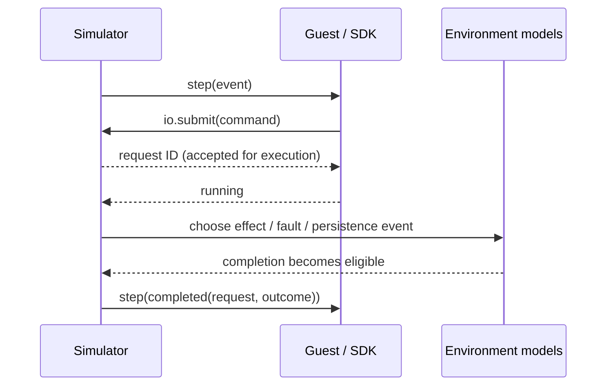

# Adversary execution and platform interface RFC

**Status:** proposed architecture, not an implemented product contract. **Research cut:** 8 September 2026. **Audience:** implementers and engineers evaluating adoption. **Decision:** a Rust-first, capability-based, cooperative simulation platform with a native production adapter and a Wasmtime Component adapter. The component ABI uses synchronous WIT calls to submit asynchronous operations; it does not require native Component Model async.

The normative candidate schema is also supplied as `adversary-platform.wit`. Its four worlds were parsed, embedded in dummy modules, componentized, and extracted using `@bytecodealliance/jco` 1.20.0. This validates the schema and component type wiring, not the proposed runtime or language SDKs. Code snippets and CLI commands below are designs unless explicitly identified as existing tool commands.

## 1. Executive summary

Adversary should control **I/O completion, transport availability, persistence, clocks, entropy, process lifetime, and supported task scheduling**. It should leave framing, RPC, retries, WAL encoding, checksums, recovery, replication, transactions, and correctness specifications in application-owned code.

Choose a small platform contract consisting of asynchronous positional file I/O, explicit file and directory synchronization, bounded byte-stream connections, an optional unreliable packet transport, local clocks and timers, named deterministic entropy streams, cooperative task wakeups, and observation/history records. Use familiar language APIs over this contract. Compile the same correctness-critical source against native production implementations and the Adversary adapter. WIT belongs inside the adapter, not throughout database code.

Use Wasmtime Components for node isolation, import auditing, distribution, and clean process reset. WIT avoids inventing an allocation/ownership ABI and creates a credible route to other languages. Neither Wasm nor WIT automatically makes a language runtime deterministic. Restrict initial guests to a single execution lane, bounded calls, and approved imports. Do not promise arbitrary Tokio, goroutine, pthread, or native-binary compatibility.

The capstone should implement the eventual request/completion architecture, even if the guest is a hand-written event machine. It may use packets and precreated files, but must distinguish **submission, effect, durable persistence, and completion delivery**. A synchronous `write` that always persists before returning would prove the wrong thesis. The capstone's restricted crash model must be named and visible in every result.

The architecture is conditionally justified for greenfield systems and existing systems with isolated effects. It is a poor retrofit for a complete OS-bound database. Before investing in broad SDKs, integrate one real framed-stream/WAL/recovery slice and compare its unchanged code, replay stability, and cost against a native deterministic backend. Commonware, MadSim, and the expanding Turmoil ecosystem make Rust-only differentiation a demanding test.

## 2. Problem statement

Distributed safety failures often occur across boundaries: a follower replies before storage is durable; a sender mistakes transport acceptance for remote processing; cancellation leaves an operation effective but unobserved; recovery trusts a torn record; a lease assumes comparable clocks. Testing only the pure state machine misses these errors. Executing an entire machine faithfully is much broader than this team's budget.

The product question is therefore which production behavior can be retained while replacing enough of the environment to choose and replay these interactions. The unit under test must include the implementation that establishes the relevant ordering. A simulator that reimplements the implementation's WAL or retransmission protocol may merely verify its own replacement.

This RFC defines a supported platform, not a universal machine model. A passing test means the supplied program and checker survived the explored executions of the declared models. The production claim additionally depends on the native adapters meeting those contracts and the deployment satisfying the fault assumptions.

## 3. Design goals

1. **Testing power:** expose durability-before-response, framing, timeout, cancellation, recovery, and replication dependencies.
2. **Shared implementation:** retain all correctness-critical code within the chosen coverage boundary, including effect orchestration.
3. **Manageable integration:** use ordinary files, streams, clocks, and futures; confine ABI and simulator machinery to adapters and tests.
4. **Deterministic execution:** replay identical artifacts and choices exactly, detect divergence, and preserve evidence.
5. **Faithful failures:** attach every injected behavior to a named environment contract and fault envelope.
6. **Bounded complexity:** single-process simulation, explicit scheduling points, finite resources, and limited platform profiles.
7. **Extensibility:** permit additional guest languages and stronger exploration without replacing the request/completion protocol.

Priority order: testing power and production correspondence; integration cost; feasibility and developer experience; tractability; extensibility; language breadth. Language neutrality cannot excuse losing the implementation being tested.

## 4. Non-goals

No Linux implementation, universal syscall compatibility, arbitrary native binaries, exact TCP congestion control, device firmware, production performance prediction, weak-memory model checking, or proof of correctness. No built-in database, WAL, consensus, SQL, transaction, or linearizability semantics in the platform. No automatic migration of a multithreaded program into a single-threaded simulation. No universal filesystem crash guarantees.

The production application runs natively. Adversary does not require deploying databases inside Wasm. Production isolation and deterministic testing are separate requirements.

## 5. Terminology

| Term | Meaning |
|---|---|
| Actor | A simulated node, client, or external-service implementation with its own instance and identity. |
| Machine | A failure domain containing actors and attached volumes; v0 uses one node per machine. |
| Turn | One non-reentrant `node.step(event)` invocation. |
| Request | A submitted asynchronous operation, identified within an actor incarnation. |
| Effect point | Internal model transition where an operation changes or observes state. It precedes or coincides with completion readiness. |
| Completion delivery | A later guest event reporting a request's outcome. It is distinct from its effect. |
| Persistence event | Movement from volatile storage state to a crash-surviving state. |
| Profile | A versioned network, storage, clock, scheduling, and resource contract. |
| Fault envelope | The failures and limits under which a property is claimed, including recovery/fairness assumptions. |
| Incarnation | Host-side identity of a particular process lifetime; stale requests never address a new instance. |
| Simulation time, T | Global, nondecreasing logical time used only by the harness and scheduler. |
| Shared core | Production source retained in the simulation build; its exact coverage boundary must be reported. |

## 6. Real-world distributed-system requirements

The following inspection deliberately goes deeper on a few systems. Source links to `main`/`master` are moving snapshots inspected for this RFC; adopters must pin revisions. They are not claims about every released version.

| System / source | Observed production boundary | Consequence for Adversary |
|---|---|---|
| [etcd/raft integration](https://github.com/etcd-io/raft/blob/main/doc.go), [RawNode](https://github.com/etcd-io/raft/blob/main/rawnode.go) | `Tick`/`Step` advance a deterministic protocol; `Ready` exposes state, persistence, messaging, and application work. Some replication and persistence can overlap under explicit obligations. | State-machine adoption can be straightforward. Preserve dependency orchestration; do not impose the incorrect rule that every send waits for every disk write. |
| [etcd Raft implementation](https://github.com/etcd-io/raft/blob/main/raft.go) | `msgsAfterAppend` delays particular append/vote responses until required unstable state is persisted. | The simulator must distinguish an accepted write from its durable completion. |
| [etcd transport](https://github.com/etcd-io/etcd/blob/main/server/etcdserver/api/rafthttp/stream.go) | Reader/writer goroutines, encoding, flushing, bounded channels, heartbeats, connection replacement, and cancellation surround Raft messages. | Testing `Step(message)` alone excludes important production transport behavior. Byte streams retain more of this implementation. |
| [etcd WAL](https://github.com/etcd-io/etcd/blob/main/server/storage/wal/wal.go) | Encoder flushing and `Fdatasync`; segment rollover synchronizes a new file, renames it, then synchronizes the directory. | WAL and publication logic belong above the platform. File data and names need separate durability. |
| [TigerBeetle architecture](https://github.com/tigerbeetle/tigerbeetle/blob/main/docs/ARCHITECTURE.md), [storage implementation](https://raw.githubusercontent.com/tigerbeetle/tigerbeetle/main/src/storage.zig) | A disciplined event loop overlaps asynchronous I/O. Storage uses sector operations and zone-specific durability behavior. The weak message contract deliberately excludes the concrete MessageBus from VOPR. | Excellent evidence for semantic adapters, but a specialized network/storage architecture, not universal compatibility evidence. |
| [Pebble VFS](https://github.com/cockroachdb/pebble/blob/master/vfs/vfs.go), [crashable memory filesystem](https://raw.githubusercontent.com/cockroachdb/pebble/master/vfs/mem_fs.go) | Ordinary file operations, file/directory sync, and replaceable filesystem implementations. Crash cloning can retain selected unsynced blocks and directory state. | A useful crash model can exist without a kernel; files are a natural integration boundary for existing engines. |
| [Pebble object storage](https://raw.githubusercontent.com/cockroachdb/pebble/master/objstorage/objstorage.go) | Immutable object completion and provider namespace synchronization have separate obligations. | Byte objects are viable for some new systems, but do not eliminate metadata durability questions. |
| [RisingWave workspace](https://raw.githubusercontent.com/risingwavelabs/risingwave/main/Cargo.toml) | Runtime/client package substitutions, pinned MadSim packages, and transitive dependency patches. | Familiar facades lower direct edits but create a continuing compatibility-maintenance cost. |
| [CockroachDB HLC](https://raw.githubusercontent.com/cockroachdb/cockroach/master/pkg/util/hlc/hlc.go) | An injected wall clock, manual clock support, offset assumptions, and clock-jump checks. | Perfect shared time would omit relevant lease/clock failures. HLC itself remains shared application code. |

Recurring dependencies are transport/RPC, storage workers, clock sources, timers, randomness, and task ownership. Configuration and discovery can initially be immutable inputs; runtime discovery must eventually be an explicit service or effect. Metrics and logs are outputs, unless the application reads them back, in which case that feedback is an input requiring control. TLS, DNS, object stores, compression, and serialization are not inherently platform primitives: retain the actual library when feasible, otherwise identify the replaced dependency and its lost coverage.

The meaningful shared-code inventory includes recovery parsers, checksums, encoding, batching, deduplication, quorum accounting, timeout/retry state, stream framing, task cancellation, and ordering of sync and responses. Sharing only the consensus algorithm is a useful protocol test, but cannot substantiate a full-database claim.

## 7. Prior art and design lessons

### 7.1 Control boundaries and execution

| System | Control boundary and required changes | What runs / concurrency | Deliberate limits and lesson |
|---|---|---|---|
| FoundationDB | Flow and replaceable network/file/time interfaces; software is built for this environment. | Substantial production server code and workloads in a single-threaded simulated cluster. Timed futures/actors cooperate. | Blocking/native thread paths escape the model; client multithreading has separate tests. This is a production precedent for controlled concurrency, not evidence of effortless retrofits. [Testing](https://apple.github.io/foundationdb/testing.html), [client testing](https://apple.github.io/foundationdb/client-testing.html) |
| Antithesis | Deterministic VM/hypervisor beneath supplied Linux-container systems; harness and optional assertions. | Real binaries, language runtimes, OS behavior, and dependencies within the supported machine environment. | Broad compatibility requires controlling the stack below the application. Machine constraints and platform-specific deployment remain. Public descriptions do not specify an implementable equivalent hypervisor. [Architecture](https://antithesis.com/blog/deterministic_hypervisor/), [environment](https://antithesis.com/docs/configuration/the_antithesis_environment/) |
| TigerBeetle VOPR | Compile-time clock/network/storage substitution in a deliberately structured Zig system. | Production replication, recovery, and business logic on one execution thread with asynchronous callbacks. | Concrete transport/disk adapters and some bindings are outside the simulation. Those omissions motivated complementary native tests. [VOPR](https://github.com/tigerbeetle/tigerbeetle/blob/main/docs/internals/vopr.md), [Vortex](https://tigerbeetle.com/blog/2025-02-13-a-descent-into-the-vortex/) |
| MadSim | Rust runtime and package substitution, including Tokio-like APIs and service clients. | Futures polled by a seeded executor; simulated nodes can be paused, killed, and recreated. | Not a sandbox; transitive effects must be patched or audited. Dropping a Rust future can run destructors, unlike a hard process kill. [Project](https://github.com/madsim-rs/madsim), [executor](https://github.com/madsim-rs/madsim/blob/main/madsim/src/sim/task/mod.rs) |
| Turmoil | Rust host/runtime plus Tokio-like network types; filesystem and io_uring work now also exists. | Hosts and clients run on one thread, with virtual time and configurable host ordering. | Source/library substitution still required. Current filesystem, io_uring, and barriers have unstable surface areas. Historical “network-only” descriptions are stale. [Current README](https://github.com/tokio-rs/turmoil/blob/main/README.md), [manifest](https://github.com/tokio-rs/turmoil/blob/main/crates/turmoil/Cargo.toml) |
| Shuttle | Replacement Rust synchronization, thread, async, and randomness APIs. | Randomized and bounded schedule exploration; encoded schedules replay failures. | Not a distributed disk/network simulator. A strong complement for adapter races and small concurrent components. [API](https://docs.rs/shuttle/latest/shuttle/), [source](https://github.com/awslabs/shuttle) |
| Loom | Modeled Rust synchronization/atomic operations in small tests. | Interleaving/memory-behavior exploration with reductions. | No network/storage/lifecycle model; current README documents incomplete C11 modeling, including possible false positives and missed behaviors. Use for scoped synchronization tests, not blanket proof. [Project](https://github.com/tokio-rs/loom) |
| Commonware | Explicit runtime traits, deterministic and Tokio production implementations. | Shared Rust futures against clock, spawning, network, and storage capabilities; an auditor identifies divergence. | A direct competitor to the proposed semantic contract. Wasm must contribute more than renaming these capabilities. [Runtime design](https://commonware.xyz/blogs/commonware-runtime), [deterministic runtime](https://docs.rs/commonware-runtime/latest/commonware_runtime/deterministic/index.html) |

### 7.2 Environment models, faults, replay, and checking

| System | Network / storage / time | Failures and replay | Invariants and DX |
|---|---|---|---|
| FoundationDB | Current `Sim2Conn` models byte reads/writes, readiness, finite buffering, and disconnects. `IAsyncFile` exposes positional I/O, truncate, sync, size, and distinct flush behavior. Virtual delays wrap operations. | Machine/reboot/network/disk faults and seeded runs; deterministic workloads are required. | Built-in and user workloads verify properties; production performance tests remain separate. Source is now `sim2.cpp`, not older actor-file paths. [Network simulator](https://github.com/apple/foundationdb/blob/main/fdbrpc/sim2.cpp), [file contract](https://github.com/apple/foundationdb/blob/main/flow/include/flow/IAsyncFile.h) |
| Antithesis | Network faults occur below application streams. Controls include packet loss, clogs, asymmetry, node faults, and wall-clock skips; the documented skip affects shared wall time, not independent skew. | Pause/kill/stop/throttle and storage retention configuration; replay/exploration of complete environments. Sector-level public storage semantics are insufficient to reproduce independently. | Optional internal assertions plus external tests; stable assertion identities and reachability matter. It is incorrect to call Antithesis exclusively black-box. [Fault types](https://antithesis.com/docs/product/writing_tests/controlling_faults/fault_types/), [assertions](https://antithesis.com/docs/product/writing_tests/assertions/) |
| TigerBeetle | Protocol packets can drop, duplicate, reorder, clog, or partition. Sector simulator models delayed callbacks, corrupt/misdirected writes, and crash faults. Its fault atlas incorporates application layout/recoverability. | Seeds plus source revisions; crash/reset discards pending callbacks. Liveness phases establish a healthy core and constrain ongoing faults. | Extensive local assertions and global protocol/storage checks. These application-aware oracles should be extensibility points in Adversary. [Packet simulator](https://github.com/tigerbeetle/tigerbeetle/blob/main/src/testing/packet_simulator.zig), [storage simulator](https://github.com/tigerbeetle/tigerbeetle/blob/main/src/testing/storage.zig), [liveness](https://tigerbeetle.com/blog/2023-07-06-simulation-testing-for-liveness/) |
| MadSim | Current APIs include TCP, UDP, endpoints, DNS, time and filesystem. Inspected generic filesystem source has no-op sync and a TODO power-failure path. | Seeded task/network choices and node controls; application entropy interception needs care. Do not infer torn-write coverage from API names. | Ordinary Rust assertions and project-specific workloads/plugins; custom external-service models can differ from real services. [Network API](https://docs.rs/madsim/latest/madsim/net/index.html), [filesystem source](https://github.com/madsim-rs/madsim/blob/main/madsim/src/sim/fs.rs), [entropy source](https://github.com/madsim-rs/madsim/blob/main/madsim/src/sim/rand.rs) |
| Turmoil | Configurable TCP/UDP buffers, latency and timers. Documented TCP failure breaks connections rather than implementing retransmission. New filesystem work distinguishes pending/durable state and advertises torn writes. | Seed, host order, partitions, holds/releases, crash/bounce controls; the simulator seed does not seed arbitrary app randomness. | Ordinary tests, traces and optional barriers. Validate exact unstable file-operation semantics before claiming native filesystem equivalence. [Builder](https://docs.rs/turmoil/0.7.2/turmoil/struct.Builder.html), [filesystem](https://github.com/tokio-rs/turmoil/blob/main/crates/turmoil-fs/README.md) |
| Shuttle / Loom | Synchronization and memory-access boundaries, not distributed network or storage. | Shuttle has random/PCT/bounded-DFS scheduling and replay; Loom explores supported permutations within bounds. | Ordinary assertions; substitute modeled APIs and keep test state small. They cover races excluded by Adversary's cooperative lane. [Shuttle](https://docs.rs/shuttle/latest/shuttle/), [Loom limitations](https://github.com/tokio-rs/loom) |
| Commonware | Stream/sink networking and named storage blobs with positional reads/writes, resize and sync. Blob/namespace guarantees differ from POSIX-like files. | Deterministic runtime/auditor; storage contracts explicitly address dropped operations and restart synchronization. | Normal application tests against runtime traits. Published docs resolved different current versions during research: Network/deterministic pages showed 2026.7.0 and Storage/Blob showed 2026.9.0. These links are rolling documentation, with that observed version context. [Network](https://docs.rs/commonware-runtime/latest/commonware_runtime/trait.Network.html), [Storage](https://docs.rs/commonware-runtime/latest/commonware_runtime/trait.Storage.html), [Blob](https://docs.rs/commonware-runtime/latest/commonware_runtime/trait.Blob.html) |

Two further checks matter. [Hermit](https://github.com/facebookexperimental/hermit) shows syscall interception can execute unmodified supported Linux programs, but also exposes a large compatibility surface and external-input limitations; its repository is in maintenance mode. [Polar Signals' 2024 FrostDB experiment](https://www.polarsignals.com/blog/posts/2024/05/28/mostly-dst-in-go) used Wasmtime and Go runtime adjustments, found real data-loss/duplication bugs, and reported occasional replay failures and limited scheduling control. Wasm can be useful without making determinism automatic.

The strongest lesson is not simply “simulate more.” Preserve the relevant implementation, choose admissible faults, and build independent oracles. TigerBeetle's [2025 fuzzer account](https://tigerbeetle.com/blog/2025-06-06-fuzzer-blind-spots-meet-jepsen/) describes a missed query bug caused by workload-generation blind spots. Its [August 2026 protocol-aware testing article](https://tigerbeetle.com/blog/2026-08-20-protocol-aware-dst/) demonstrates the added value of global internal checks. Neither deterministic execution nor black-box histories alone guarantee adequate coverage.

## 8. Design-space analysis

Scores below are engineering judgments for this project's targets, not measured product rankings. H/M/L are relative; “cost” columns favor lower values. Fidelity means correspondence for the supported implementation, not perfect hardware emulation.

| Boundary | Compatibility | Determinism | Semantic visibility | Fidelity | Build cost | Language independence | Tractability | Retrofit cost | Throughput potential | Storage faults | Concurrency control | Adversary fit |
|---|---|---|---|---|---|---|---|---|---|---|---|---|
| 1. Application-specific simulator | Low | High | High | Low–high for one protocol | Low initially | Medium | High | High | High | Narrow/custom | Algorithm only | Demo/checker library only |
| 2. Generic semantic capabilities | Medium for isolated effects | High with discipline | High at effects | High within contract | Medium | High at ABI | High | Medium–high | High | Strong explicit models | Cooperative tasks | **Core choice** |
| 3. Familiar runtime facade | Medium–high in one ecosystem | High if complete | Medium–high | High within facade | Medium–high maintenance | Low–medium | High | Low–medium | High | Good if genuinely modeled | Supported runtime only | **SDK layer over 2** |
| 4. Deterministic WASI host | Medium for Wasm software | High only after audit | Medium | WASI semantics; crash model extra | High for breadth | High, uneven tooling | Medium–high | Medium–high | Medium–high | Custom backend still needed | Runtime integration extra | Later selective facade |
| 5. Syscall interception | High on supported OS | Hard across all inputs | Low–medium | High OS-facing behavior | Very high | High for binaries | Low–medium | Low | Medium | Powerful but complex | Native thread scheduling | Reject for this team |
| 6. Deterministic kernel/VM | Highest within machine support | High when whole stack controlled | Low unless instrumented | Highest stack coverage | Extreme | High | Low without sophisticated exploration | Lowest source edits; deployment work | Lower/costly | Broad machine-level faults | CPU/OS threads | Reject as implementation scope |

A facade and a capability contract are complementary layers. The selection is not an ambiguous compromise: implement boundary 2; deliver Rust SDK behavior resembling 3; use Components as the executable ABI; selectively translate WASI later. Do not build 4 first and hope nondeterminism disappears.

Feasibility and preservation of the target implementation are hard gates, not weaknesses that an attractive average score can conceal. Among feasible options, rank by testing power and production correspondence first, integration cost second, then DX, tractability and future language support. Semantic capabilities with a familiar SDK win that comparison for the selected segment. If zero-modification native compatibility becomes mandatory, the ranking changes and this RFC's chosen scope should be abandoned.

## 9. Why this abstraction boundary

The cut belongs below application transport/storage state machines and above OS policy. A stream is sufficiently low to test fragmented frames, reconnects and cancellation without modeling TCP packets. A file is sufficiently low to test WAL truncation, checksums and checkpoint publication without implementing directories, permissions, mounts, or journaling algorithms generally. Scheduling one supported task poll preserves async control flow while avoiding instruction-level interleavings.

The host knows that request 87 writes file F, request 91 flushes F, and stream S becomes unreadable. It does not know whether a byte sequence is a Raft vote or a transaction commit. Application checkers may interpret observations and histories; application fault policies may match declared tags, but the platform never silently supplies application semantics.

The resulting contract is small in operations but necessarily substantial in semantics. “Small” means a bounded implementable surface, not a five-function API that hides durability or transport behavior. Adding higher-level libraries is preferable to adding database concepts to the runtime.

## 10. WebAssembly and WIT decision

### 10.1 Current status, with version context

WASI 0.3.0 was released on 11 June 2026 and 0.3.1 on 11 August. It adds native async functions, streams, and futures. Wasmtime 46 shipped the final 0.3 interfaces; the stable release verified for this research is Wasmtime 48.0.1, dated 24 August. Do not base this architecture on an obsolete claim that P3 is only a future proposal. [WASI release](https://wasi.dev/releases/wasi-p3), [Wasmtime 46](https://github.com/bytecodealliance/wasmtime/releases/tag/v46.0.0), [Wasmtime 48.0.1](https://github.com/bytecodealliance/wasmtime/releases/tag/v48.0.1)

The Component Model remains on the road to formal 1.0 despite real deployed tooling. Native async introduces its own concurrency semantics; it does not supply a deterministic exploration scheduler. Use released synchronous records/results/lists and explicit completions first. [Component Model status](https://bytecodealliance.org/articles/the-road-to-component-model-1-0), [concurrency design](https://github.com/WebAssembly/component-model/blob/main/design/mvp/Concurrency.md)

| Language | Viable current workflow | Adoption claim justified here |
|---|---|---|
| Rust | Native `wasm32-wasip2` target, reactor/component export bindings with `wit-bindgen`; current guide deprecates reliance on `cargo-component`. | Best first SDK. Rust futures compile, but arbitrary Tokio/native dependencies do not automatically work. [Guide](https://component-model.bytecodealliance.org/language-support/building-a-simple-component/rust.html), [target](https://doc.rust-lang.org/rustc/platform-support/wasm32-wasip2.html), [Tokio limits](https://docs.rs/tokio/latest/tokio/#wasm-support) |
| Go | Upstream Go plus `componentize-go`; current guide requires Go 1.25.5+, and 0.4.2 includes async build support. | An actual route beyond TinyGo exists. Host scheduling of arbitrary goroutines/select is still unproven for Adversary. [Guide](https://component-model.bytecodealliance.org/language-support/building-a-simple-component/go.html), [0.4.2](https://github.com/bytecodealliance/componentize-go/releases/tag/v0.4.2) |
| C/C++ | `wasi-sdk` 34, Clang and generated WIT bindings; P3 support exists. | Suitable portable libraries and event machines. Existing thread/OS/FFI/dynamic-linking dependencies remain serious constraints. [SDK 34](https://github.com/WebAssembly/wasi-sdk/releases/tag/wasi-sdk-34), [C/C++ guide](https://component-model.bytecodealliance.org/language-support/building-a-simple-component/c.html) |
| Python | `componentize-py` with WIT and packaged Python dependencies. | Credible workload/checker language. Not a promise of arbitrary native-extension or operating-system package compatibility. [Project](https://github.com/bytecodealliance/componentize-py) |

The generic [WASI language summary](https://wasi.dev/languages) lagged the dated Go/C release evidence during research. Prefer the release-specific evidence above; neither “only Rust supports P3” nor “all languages now behave alike” is supported.

### 10.2 Explicit answers

1. **Is raw Wasm enough?** Technically yes. Imports plus linear-memory buffers can express this platform. It would leave Adversary maintaining a bespoke ABI and bindings.
2. **Use Components + WIT?** Yes, as a versioned artifact/capability ABI. Keep the Rust platform traits independent so this choice is reversible without rewriting core logic.
3. **Custom `adversary:*` interfaces?** Yes. Explicit submission/completion, scheduling and crash guarantees are product contracts that ordinary WASI does not establish.
4. **Reuse WASI subsets?** Selectively. Audit and translate clocks, I/O and deterministic startup needs. Do not install a native WASI linker with ambient filesystem/network access. Full conformance is a separate feature and test obligation.
5. **Familiar socket/file APIs?** Yes in SDKs and supported WASI facades; keep stream and positional-file semantics in the underlying model.
6. **Prevent uncontrolled effects?** Approved imports and separate instances prevent ordinary guest access to ambient network, disk, clock and entropy. Audit the entire linked component graph, including adapters and initialization.
7. **Remaining nondeterminism?** Guest/runtime scheduling, random map seeds, resource-growth failures, floating-point latitude, build-time snapshots, compiler/runtime changes, and host model bugs require explicit treatment. Source-language undefined behavior can also make native and Wasm builds differ.
8. **Multi-language reality?** Typed interoperability is practical; production library and scheduling compatibility are not uniform. First require a second language to use the same contract and meaningful shared logic.
9. **Material value or complexity?** Both. Isolation, reset and portable artifacts justify a bounded experiment. Cross-compilation and runtime integration can outweigh them. Keep a native deterministic reference adapter for comparison; do not maintain a second set of model semantics.

The [Canonical ABI](https://github.com/WebAssembly/component-model/blob/main/design/mvp/CanonicalABI.md) handles lowering/lifting, memory and ownership conventions, but does not promise zero-copy. Wasmtime's [pinned typed-call source](https://raw.githubusercontent.com/bytecodealliance/wasmtime/v48.0.1/crates/wasmtime/src/runtime/component/func/typed.rs) also makes reentry and call cleanup real implementation concerns. Never synchronously call back into a node from one of its imports.

Two WASI details require care. Secure [WASI random](https://raw.githubusercontent.com/WebAssembly/wasi-random/v0.2.6/wit/random.wit) explicitly requires fresh unpredictable data and tells deterministic environments to omit that capability. A seeded implementation must not be advertised as conforming secure entropy. The [filesystem WIT](https://raw.githubusercontent.com/WebAssembly/wasi-filesystem/v0.2.6/wit/types.wit) includes familiar operations but does not define this RFC's crash model; some synchronized-write flags are requests rather than a precise mandatory durability contract. Custom semantics are justified here.

## 11. Execution model

The stable abstraction is a **reactor with asynchronous effects**, not a synchronous disk/network API.



Normative rules:

1. Only one guest turn executes at a time in a simulation. A turn is not reentrant. Global time is constant during it.
2. `submit` validates arguments, reserves any required queue capacity, copies owned input bytes, and returns an ID or an immediate error. It never waits for virtual time or real I/O. Acceptance does not execute the operation.
3. Model effects and completion callbacks occur only after the submitting turn returns. No peer runs during that turn. Within the later schedule, a remote observation may precede delivery of the sender's completion.
4. Requests pass through `submitted → effect/in-progress → completion-ready → delivered`, or a cancellation/death path. Storage persistence is an independent relation, not a required stage of ordinary writes.
5. An accepted request has at most one completion. It eventually completes only under appropriate availability/fairness assumptions; a partitioned read may remain pending indefinitely. Incarnation death suppresses all future callbacks to that incarnation.
6. Happens-before edges include guest program order, submission before effect, effect before completion, and completion delivery before dependent submissions. Separate requests have no extra global ordering unless specified for their resource.
7. The scheduler chooses enabled internal transitions as well as guest events. It may crash a node after an operation takes effect but before its completion is delivered. Fault choices must respect the operation's permitted outcomes.
8. IDs are monotonically allocated within an incarnation and never reused there. Host lookups include actor, incarnation, kind and generation. Integers are not ambient capabilities; guesses cannot access another actor's handles.
9. All sizes, outstanding operations, turns, resources and histories are bounded by a recorded manifest. Input overflow is `invalid`; capacity exhaustion is `quota`. Unplanned host OOM invalidates the run.

For a file write, the accepted prefix can become live, then durable, then reported—or reported before becoming durable. For a connect, the connection can be established and accepted by its peer before the initiator receives its connect completion. This is normal asynchronous correspondence.

Each turn has a deterministic fuel budget. Exhaustion is a diagnostic failure, not a fabricated amount of elapsed production CPU time. Long computations must use shared explicit yield points or an SDK task decomposition. Simulation time advances to selected event timestamps; a separate optional CPU-delay profile may delay a runnable turn, without claiming cycle accuracy.

The default fair-progress scheduler gives every actor a next-turn eligibility time. After a turn at T, that actor's next turn is eligible no earlier than T+q, with manifest parameter q=1 ns by default; other actors and internal model events may still execute at T. This is an abstract service quantum, not measured instruction time. Select events at the minimum eligible timestamp and choose among ties; jump T when no event is eligible now. All transitions create finitely many immediate successors, and a recorded zero-time transition budget catches model livelock. Thus an endlessly self-waking task cannot keep all future timers at a frozen T. q=0 is allowed only in an explicitly labeled pure-event profile with turn-budget termination; do not interpret its frozen-time exhaustion as a production timer failure.

## 12. Guest lifecycle

At initial start and every restart, create a fresh Component instance and process-local host handle table, run audited initialization, then deliver exactly one `start(config-bytes)` event. Initialization imports may provide fixed configuration/logging/entropy; I/O submissions before `start` are rejected as invalid guest behavior. Destructors, TLS state, globals, tables, linear memories, task stacks and heap objects do not transfer to the new instance.

Persistent volumes and machine clocks are host-owned. The new instance gets the same configured root capabilities and must reopen files and execute ordinary recovery. It receives no automatic restored application object graph. Incarnation counters are trace metadata, not an oracle revealing simulator fault choices to application logic.

`step` returns `running` or `exited`, or an explicit `guest-failure`. `exited` is a successful process exit, observable to the harness; peers discover it through transport behavior, not a magic membership event. Exit does not sync storage. Required cleanup must be completed by application code before returning `exited`. Unexpected exits can fail a workload policy. An explicit `guest-failure`, panic, or trap fails the test by default and preserves diagnostics.

Graceful shutdown is an application/control-protocol request, carried over normal input transport. There is no mandatory `on_crash` or recovery shortcut. Fault injection must not let applications prepare for a hard crash.

## 13. Network model

### 13.1 Decision: streams for v1, optional packets

V1's general network is a **bounded, ordered, reliable byte-stream abstraction with connection failures**. It retains connect/accept, short I/O, buffers, backpressure, half-close and reconnection. It does not implement packet retransmission, congestion windows, SYN-state details, routing protocols or Linux socket options. The distinction follows TCP's application-visible stream model, not a promise to implement all of [RFC 9293](https://www.rfc-editor.org/rfc/rfc9293.html).

Use packets only when the application explicitly assumes unreliable datagram semantics, or when a protocol-module test intentionally cuts above its production transport. Do not feed arbitrarily duplicated/reordered application messages into a simulation advertised as testing a live TCP connection: TCP does not expose those behaviors within one established direction. Duplicated requests can arise from application retries across connections; keep that code in the guest.

Addresses are configured logical host names and ports. A manifest maps them to actors in simulation and concrete endpoints in production. V1 has no real DNS queries, ephemeral-port discovery API, wildcard/multihomed binding, or local socket-address query. The native adapter implements the configured subset. Dynamic DNS/service discovery requires an explicit service model or future resolve capability with latency, TTL and failures; a static lookup must not be sold as DNS testing.

### 13.2 Stream semantics

Each connection has two independently bounded send/receive directions. A successful write completion reports `n`, meaning that prefix was accepted by the **local transport**. It does not mean remotely read, application-acknowledged or durable. When buffers are full the operation remains pending. A peer can consume accepted bytes before the sender receives the completion event.

Accepted bytes that are delivered on one established direction appear exactly once and in order. Segment boundaries and read sizes are scheduler choices. A write of 8 KiB can be observed through many short reads; one read can combine multiple writes. Nonempty writes and reads never complete with zero progress unless a read reports EOF. Zero-size stream requests are rejected to avoid ambiguous wakeups; SDK no-op handling occurs locally.

A reset can discard an undelivered suffix. It cannot skip bytes and then deliver a later suffix on the same connection, or duplicate already-read bytes. Previously delivered bytes remain delivered. On a reset, buffered-but-unread bytes may be delivered before the error or discarded; choose and record a profile-consistent prefix. Ordinary faults never alter delivered byte values. Corruption of an end-to-end stream is a separate, explicitly named nonstandard fault profile.

One read and one write may be outstanding per connection; they may overlap each other. Additional same-direction requests return `busy`. The SDK's shared writer/reader queues implement this restriction in both adapters. This is suitable for common single-writer framing/RPC architectures, but excludes applications whose correctness intentionally relies on concurrent overlapping socket writes. Such applications need refactoring or a future richer contract.

`shutdown(send)` prevents new writes, drains previously accepted bytes when the connection remains healthy, then exposes EOF remotely. `shutdown(receive)` discards unread local bytes and makes local reads return EOF; how soon the peer detects refusal is a later transport event. `both` applies both. `close` releases the handle and requests send-close, while dropping local unread receive bytes. A reset can still intervene; close is not a delivery guarantee. Half-close does not terminate the opposite direction.

A partition blocks selected directional progress. It may later heal, or cause a recorded connection timeout/reset according to a configured transport-failure policy. It does not automatically inform membership or cancel RPCs. There is no deadline argument on every operation: SDK `timeout` races an explicit timer against the I/O and handles cancellation's uncertainty. Host-level transport timeouts, when enabled, have separately recorded parameters.

### 13.3 Packet semantics

`packet-send` success means the entire bounded packet was copied into the local datagram transport. Packets are atomic at receive, with no truncation in this profile. Loss, duplication, reordering, asymmetric partition and finite queues are permitted. There is no reliability or ordering guarantee, including between packets from one sender. Duplicate copies use distinct delivery IDs linked to the same send.

`packet-receive(port)` waits for a whole queued packet; only one receive per port is outstanding. Unbound/full destinations can silently drop. The receiving port is resolved when delivery occurs: an old datagram may reach a newly restarted process bound at the same address. Applications requiring incarnation discrimination must carry it in their protocol. Established stream connections, by contrast, never reattach to a new incarnation.

The capstone packet adapter should use real UDP with the same maximum packet size, or explicitly label its production transport exclusion. Calling a framed TCP adapter “equivalent” to an arbitrarily duplicating packet model is not acceptable without an application-level argument.

## 14. Storage model

### 14.1 Decision and supported surface

Default to **capability-scoped regular files with positional I/O and explicit namespace durability**. V1 roots are preprovisioned, durably existing, flat directories on one local filesystem each. Names are bounded ASCII `[A-Za-z0-9._-]+`, excluding `.` and `..`; there are no slashes, links, permissions changes, dynamic subdirectories or cross-root renames. Roots are configured capabilities, not arbitrary host paths.

This is a real limitation, but supports a useful class of WAL/SST/manifest layouts. Add directory capabilities only when an integration needs them. Do not implement append-only logs or a key/value store in the host. A shared WAL writer implements append with size/owned offset plus `write-at`, and loops on short writes. No record atomicity is implied.

Each root belongs to at most one live actor; scenario validation rejects concurrent attachment by different actors. Multiple handles in that actor can alias the same file identity. Shared volumes, interprocess file locking and filesystem races with external writers are outside these profiles.

The default storage capacity is a **logical dense-file quota**, not emulated filesystem block allocation: charge each live or open-unlinked inode its current live length once, including zero-filled gaps. Growth is limited to remaining quota; write may accept a fitting positive prefix, otherwise returns `no-space`. Shrink releases the difference; unlink releases charge only after the final live handle closes. Power-cut recovery recomputes charge from the recovered namespace, so discarded volatile deletions can restore usage. Historical versions retained by the simulator for crash exploration do not consume guest disk quota. Metadata/handle counts have separate manifest quotas. Native adapters enforce the same logical limits on a filesystem with independently adequate physical capacity; physical ENOSPC/EIO remains a mapped error. More faithful allocation/writeback-full behavior is a separate profile, not an unstated property of this one.

Raw block storage is a later selectable profile: fixed-size region, positional I/O, alignment, flush and no namespace. Byte-addressed objects are an optional library/service contract for systems already designed around them. WASI filesystem entry points can translate to the same file model; they do not replace its persistence definition.

### 14.2 Completion and concurrency guarantees

Reads observe live bytes, which may include completed but unsynced writes. A successful `write-at` reports exactly the accepted prefix and updates live length if necessary. It never implies persistence. A successful `file-sync(data)` covers data and length needed to retrieve it; `all` additionally covers supported file metadata. With no timestamps/permissions modeled, those two have equal simulated durability but preserve production intent. Neither syncs the containing root.

This separation corresponds to native `write`/`fdatasync`/`fsync`: successful writes can be partial and are not durable merely because they returned; file sync does not necessarily persist the directory entry. [Linux write contract](https://man7.org/linux/man-pages/man2/write.2.html), [Linux sync contract](https://man7.org/linux/man-pages/man2/fsync.2.html)

V0/v1 initially permit **one mutation or sync outstanding per underlying file identity**, including aliases opened through different handles. Reads may run concurrently when they do not overlap an outstanding write; reads overlapping writes or resize return `busy`. Multiple reads are allowed. Metadata size queries see one selected live size. Namespace mutations/root-sync are serialized per root; a second outstanding one returns `busy`. Distinct files and roots progress independently.

These reservations last through completion delivery, including a completion-ready request. A native adapter must enforce the same contract. The limit reduces integration breadth and same-file queue-depth testing; it does not silently impose a global disk queue of one. A later version may allow disjoint writes and explicit file fences, but must not change existing profiles' guarantees.

After a mutation completion is delivered, a subsequent file sync establishes a durable fence for that live image. Because another mutation is forbidden while sync is outstanding, the fence has an unambiguous target. A failed or interrupted sync may have persisted some or all of that image; failure does not imply rollback. A later unsynced overwrite can destroy an earlier synced value: successful sync does not make data immutable against subsequent writes.

### 14.3 Exact file-operation contracts

All operations use `io.submit(command) → result<request-id, io-error>` and a later completion. The result column identifies the required `value` variant; returning another variant is a host bug.

| Command fields → completion | Guaranteed semantics on successful completion | Permitted fault/error behavior and native mapping |
|---|---|---|
| `file-open(root,name,existing/create-new/create-or-open) → file(id)` | Resolve the live namespace at effect time. Existing returns a new handle to the same inode. Creation creates an empty live inode/name; neither is made durable by completion. `create-or-open` never truncates. | `not-found`, `exists`, `permission`, `quota`, `no-space`, `io`; latency/crash around creation. Native open/create flags. |
| `file-read-at(file,offset,limit) → data(bytes,eof)` | Return 1..limit live bytes starting exactly at offset, possibly short. Empty only at/beyond EOF. `eof` says this result reaches the size observed by this read. Limit must be positive. No multi-call snapshot. | `io`, `permission`, `busy`; delay/short read. No silent bit changes in the ordinary profile. Native pread; data-plus-error APIs are normalized to progress, then error on a subsequent call. |
| `file-write-at(file,offset,data) → count(n)` | For nonempty input, 1..len bytes become live starting at offset; extend length and zero any gap. Empty input completes count(0). Only the reported prefix is accepted on successful completion. | Short prefix, `no-space`, `quota`, `io`, `permission`, `busy`; an `io` error may leave an unreported prefix changed, with no rollback guarantee. Native pwrite; native adapter must respect the documented uncertainty. |
| `file-size(file) → size(n)` | Live length at one effect point, not durable length. | `io`; latency. Native fstat metadata. |
| `file-resize(file,size) → unit` | Change live length; growth reads as zeros and shrink removes the live suffix. Not durable. | `no-space`, `quota`, `io`, `busy`; failed mutation may have taken effect. Native ftruncate. |
| `file-sync(file,data/all) → unit` | Persist all completed earlier mutations of that file and the retrieval metadata/length. No namespace promise. Success is trustworthy under ordinary power loss. | `io`, `no-space`, `quota`, `busy`; latency and crash before/after any persistence or completion. Native fdatasync/fsync; a stronger native primitive is allowed. |
| `file-close(file) → unit` | Release this handle, not the inode/name. No implicit sync. A handle cannot close while it has outstanding requests; submission marks it closing and prevents new ones. | `busy`, `io`; even a close error invalidates the handle. Native close plus error normalization; other open handles remain valid. |
| `file-rename(root,source,destination,replace) → unit` | Atomic live same-root namespace change. `replace=false` fails if destination exists; `true` replaces it. Open handles preserve identities. Source=destination is a no-op if it exists. | `not-found`, `exists`, `permission`, `io`, `busy`. No file or root sync. Native same-filesystem rename, with no-replace implemented atomically within the adapter's exclusive root ownership. |
| `file-unlink(root,name) → unit` | Remove live name; existing open handles remain usable. Not durable. | `not-found`, `permission`, `io`, `busy`. Native unlink. |
| `root-list(root) → names(sorted names)` | Lexicographically sorted live names from one namespace state. No durability/snapshot of file contents. | `permission`, `io`; native enumeration sorted by the adapter. |
| `root-sync(root) → unit` | Persist every prior completed namespace mutation in the root. Does not persist file contents or later mutations. | `io`, `no-space`, `busy`; partial persistence before error/crash. Native directory fsync. Unsupported deployment filesystems fail conformance; do not silently return success. |

Common immediate errors apply to every operation: `invalid` for name/range/overflow/size violations, `bad-handle` for wrong-kind/closed/incarnation-invalid IDs, `unsupported` for a missing profile feature, `quota` for admission limits. Injected `permission`/read-only behavior requires a declared fault profile, not random permission changes in the default file model. Prevalidation errors have no effect. Namespace `io` failures may leave the whole atomic change applied or unapplied; they may not half-apply a live rename. Native adapters own their roots exclusively; no uncontrolled external process modifies them.

### 14.4 Named persistence profiles

**`buffered-file-prefix-v0` — capstone.** Files and names are precreated durably. Maintain each file's ordered whole-mutation versions and a durable frontier. Writes/resizes are logically atomic at operation granularity. Background persistence and power-cut resolution choose a prefix beyond the previous frontier, possibly empty or complete. Successful sync moves the frontier through all completed prior mutations. A mutation may take effect before its completion reaches the guest. This profile finds omitted sync and response-ordering bugs; it misses block tearing, reordered persistence and namespace errors. It is an under-approximation, not “a disk simulator” without qualification.

**`journaled-root-file-v1` — required for v1.** Keep live namespace state, a persisted namespace prefix, per-file live bytes/length, and persisted byte-unit/length versions. Each successful namespace operation is one ordered atomic root mutation; background persistence advances its prefix, and root-sync advances through its fence. Thus crash recovery selects a valid old/new rename state, never independently randomizes its source and target. Creation persistence ensures a recoverable inode identity, initially empty unless content/length versions also persisted. File-sync may preserve an orphan inode whose name is not yet durable.

For file contents, the manifest selects a persistence unit U (default 512 bytes, explicitly a model parameter). Each logical write creates merged unit versions for exactly its changed region; untouched bytes keep their earlier values. Persistence can advance different units in any order, but never move a unit back behind its already-persisted version. Length is separately versioned. A power cut retains a legal prefix of these persistence micro-events, including partial progress of an operation with no delivered completion. A recovered file may have new length with missing/zero data, or persisted data beyond a shorter recovered length. Truncate/growth use versioned zero/tombstone effects so re-extension cannot reveal bytes forbidden by the chosen operation order. File sync persists all unit and length effects through its fence.

The default unit-atomic profile permits an old/new mixture across units, not arbitrary bits within a unit. An explicit **`byte-tear-v1`** variant sets U=1 over changed ranges, permitting within-sector tearing; an optimized range representation need not allocate one object per byte. Profiles select coarse adversarial split points first, then refine. No assumption of universal 512-byte or 4-KiB hardware atomicity is made. Previously durable bytes outside later write/truncate regions cannot spontaneously change in an ordinary crash.

**`media-fault-v1` — opt-in.** Add bad ranges, read `io`, incorrect returned bytes, persistent bit corruption, or write misdirection. Each class has a separate policy and trace event. Such faults may invalidate previously synced content; they represent media/device failure, not ordinary unsynced-write loss. Fault budgets and expected detection/repair behavior must be specified. A checker may require corruption detection rather than continued service after irrecoverable media loss.

These are explicit abstract models. They are not claimed to contain every outcome of ext4, XFS, NFS, Windows filesystems or failing firmware. Linux filesystem persistence depends on deployment details; [ALICE's application crash-consistency study](https://www.usenix.org/conference/osdi14/technical-sessions/presentation/pillai) and [current ext4 journal documentation](https://cdn.kernel.org/doc/html/latest/filesystems/ext4/journal.html) support treating those differences seriously. Validate the target profile against the chosen native deployment and run complementary actual crash tests.

### 14.5 Process death versus storage power loss

`kill-process` removes guest memory, tasks, handles and callbacks. It **retains the machine's kernel-like live page cache**. Already-issued storage operations may complete in the model; accepted network bytes may still leave the kernel-like transport. Restart can observe unsynced live bytes. Therefore killing a process alone must not deterministically erase every unsynced file write.

`power-cut(machine)` additionally resolves permitted in-flight persistence, discards volatile storage/cache state, drops the machine's unsent transport buffers, and stops its actors. Reboot reattaches recovered durable volumes. Bytes already in the modeled network may still reach other machines. V0's “node crash” CLI must expand to an explicitly recorded `power-cut`, while also offering `kill-process` separately; do not overload one ambiguous command.

For v0/v1, process restart includes a **storage quiescence barrier**: cancel requests not yet handed to the model device; settle device-issued operations from the old incarnation before delivering the new `start`. Do not flush merely to quiesce. The harness can interleave other actors, faults and a subsequent power cut while draining. This prevents orphan I/O from violating the new incarnation's per-file reservations or overwriting recovery later. Native adapters/supervisors must establish the corresponding old-worker/device-operation quiescence. Platforms unable to do so need a separately specified restart profile; do not assume killing a userspace task universally cancels kernel I/O.

## 15. Time and timer model

The host tracks global T in unsigned nanoseconds. Guests see `clock.now() → {monotonic-ns, unix-ns}` for their machine. V0 uses a shared-rate local monotonic clock with configured offsets and fixed wall-time mapping; v1 permits independent rate/skew and wall jumps. All arithmetic is checked; overflow invalidates the scenario, never wraps time.

Let M_i(T) be machine i's monotonic clock: an initial nonnegative offset plus integrated strictly positive piecewise-rational rate. Rate changes are host events and cannot make M decrease. W_i(T) is a separately configurable signed Unix-time mapping with positive/negative wall jumps. The manifest records origins, resolutions, rate bounds and changes. Wall time is not used internally to order simulation events.

`timer-at(deadline)` creates a one-shot request. It becomes eligible at the first T with M_i(T) ≥ deadline, then completes with `unit`; delivery can be delayed by scheduling or node pause. A past deadline is eligible after the submitting turn, never a nested callback. Rate changes recalculate future eligibility. Wall-clock jumps do not fire monotonic timers. Timer cancellation follows the same request cancellation rules as I/O.

SDK operations have these exact meanings:

| SDK operation | Definition |
|---|---|
| `now_monotonic()` / `now_wall()` | Fields from the current local clock sample; neither yields. |
| `sleep(d)` | Checked `now_monotonic()+d`, then await `timer-at`. `sleep(0)` still yields through a later completion. |
| `deadline(t)` / `timer(t)` | One-shot local monotonic absolute timer; not a globally comparable timestamp. |
| `timeout(d, future)` | Race that timer with the operation/task. Which eligible completion is delivered first is an explicit choice. Timeout means the caller stopped waiting; it does not mean the operation had no effect. |

For equal timestamps, the normal randomized scheduler chooses among eligible events and records the choice; deterministic baseline mode sorts by stable event ID. This avoids always testing the same node first. Either policy replays exactly. Cancellation after expiry becomes completion-ready may be too late even if the handler has not run.

A process pause stops turns, not its machine clocks or kernel-like I/O. Process restart preserves machine monotonic time; machine reboot starts a new monotonic era, with no monotonic comparisons across eras. Wall time follows configured boot policy. Native monotonic sources must match this documented treatment of process pauses; machine-suspend accounting is outside v1. Lease/HLC logic and conversions from wall-clock deadlines remain in the application.

## 16. Randomness model

Expose `entropy.bytes(domain,count)`; SDK helpers provide `random_u64` using little-endian decoding and RNG handles storing a domain label. Calls are immediate, bounded, non-yielding, and consume exactly the requested bytes. Invalid domain/size or entropy-budget exhaustion returns `invalid`/`quota` without consuming output. Empty requests succeed without advancing the stream.

Use the fixed proposed generator **`advr-rng-1`**. The manifest stores a 32-byte root seed. A decimal CLI seed is converted to its eight-byte little-endian representation and zero-padded to 32 bytes. Derive each 32-byte stream key with HKDF-SHA256, IKM=root seed, salt=UTF-8 `adversary-rng-1`, and info consisting of a one-byte scope (0=host, 1=guest), length-prefixed UTF-8 actor identity, little-endian u64 incarnation, and length-prefixed UTF-8 domain. Lengths are little-endian u32. Run RFC 8439 ChaCha20 with that key, a zero 96-bit nonce and initial block counter zero. Return consecutive stream bytes, independent of request chunking; fail with `quota` before the 32-bit block counter would wrap. Publish cross-language test vectors before release. [HKDF definition](https://www.rfc-editor.org/rfc/rfc5869.html), [ChaCha20 definition](https://www.rfc-editor.org/rfc/rfc8439.html)

Simulator scheduling, network, disk, workload generation, application protocol jitter, and runtime/hash seeding use separate domains. Host streams use scope 0 and fixed host identities; guest calls cannot address that scope. Never use Rust's unspecified default RNG behavior as a replay format.

Trace the domain, offset, count, and output digest for every application entropy call. Keep full bytes where requested for forensic export; a replay bundle with pinned algorithm/seed regenerates them and verifies the digest. Simulator choices are separately recorded as choices, so adding a log statement cannot consume the application election RNG. Sequential call-count changes within a domain still alter subsequent output; domain separation reduces, not eliminates, that coupling.

Protocol randomness can be explored through allowed output choices or seed changes; mark whether an exploration distribution is intentionally adversarial. Do not independently mutate cryptographic protocol internals to impossible states. Simulation cryptographic entropy is explicitly test-only deterministic material. The production adapter uses an approved native entropy source; simulation credentials/keys must not be deployed. A secure WASI import is omitted unless a clearly labeled nonconforming test shim is required and enabled. Simulator entropy must never be confused with production security guarantees.

## 17. Concurrency model

| Model | Determinism / exploration | Code sharing and language implications | Decision |
|---|---|---|---|
| A. Synchronous event machine | Simple and exact between turns; misses internal interleavings. | Natural for RawNode/callback/event-loop cores; rewriting an async program into a second event machine is unacceptable. | **v0**, using a shared event machine in native and simulated builds. |
| B. Cooperative SDK tasks | Host chooses a registered runnable task; one `Future::poll` or equivalent step is atomic. | Retains async control flow over supported effects; language SDK must surface task identity/wakes correctly. | **v1 default for Rust**, while retaining A. |
| C. Runtime-compatible facade | Controls only correctly replaced APIs; transitive bypasses are dangerous. | Lowest edits within supported Tokio-like subset; costly to claim full ecosystem compatibility. | Provide a narrow facade over B, explicitly versioned. |
| D. Arbitrary Wasm threads | Requires shared-memory/memory-model scheduling and runtime integration; state space grows sharply. | Would help some existing code but does not solve native OS dependencies. | **Forbidden in v0/v1.** |

The v1 SDK owns futures, wakers, task tables, mutexes/channels, cancellation and join handles. It assigns never-reused task IDs and calls `make-runnable(id)`. The host coalesces repeated wakes while a task is queued. On `run-task(id)`, the SDK polls exactly that task once. The queued bit is cleared before polling, so a self-wake schedules a later turn. Polling may submit I/O; completions update SDK result slots and wake waiting tasks, without directly polling them inside the completion dispatcher.

A task that returns Ready retires its ID. Wakers check retirement before submitting new wakeups; an already-queued wake for a known retired ID is a harmless SDK no-op. An ID never allocated by the SDK is a contract failure. This avoids needing an additional cross-language task-destruction primitive.

A `.await` on an already-ready future is not necessarily a yield. Guest-internal channel operations may run to completion within one poll unless the shared SDK introduces an explicit scheduling point. SDK `yield_now` makes the task runnable and returns Pending. Mutex handoff/channel wake order is deterministic, versioned, and can be an explicit exploration choice; it must not inherit hash-map iteration order.

Cancellation of a task drops its future in the shared language semantics, possibly running destructors. That is distinct from process death, which discards the Wasm instance without executing application cleanup. Canceling I/O does not automatically roll back external effects. Worker pools are modeled as bounded logical workers with completion events for supported work; native OS thread pools remain outside the schedule coverage unless replaced by the same structured task abstraction.

Production may use a multithreaded executor if the shared core's synchronization contract is safe there. Adversary tests the cooperative executions only. Use Loom/Shuttle, stress tests, sanitizers and native end-to-end tests for synchronization/adapter behavior excluded by the model. Do not advertise a single-threaded simulation as coverage of native weak-memory races.

## 18. Failure model

Fault policies are deterministic harness programs or declarative selectors over semantic events. They may match actor, machine, request kind, resource, time window, and explicit application tags. They must not obtain hidden protocol knowledge unless supplied by the user. Each effect records policy rule, choice, and fault envelope.

| Action | Exact state/lifetime effect | Observation and admissibility |
|---|---|---|
| `start(actor)` | Instantiate only if stopped; attach configured volumes, queue start. | Harness sees start. No application membership notification. |
| `kill-process(actor)` | Discard guest state, handles/tasks/timers/callbacks; retain machine cache. Copied in-flight effects may continue. | Connections eventually close/reset according to profile. No implicit fsync or application cleanup. |
| `power-cut(machine)` | Stop its actors, resolve storage crash state, lose volatile cache/unsent local transport. | Restart requires explicit reboot/start. Synced data survives absent a separate media fault. |
| `restart(actor)` | Fresh instance, same configuration/roots; ordinary recovery executes. | No restored heap or stale callbacks. |
| `pause(actor)` / resume | Preserve guest state and ready events; skip its turns. Other actors, local clocks and kernel-like I/O continue. | Models process scheduling pause. Whole-machine suspension is a different future profile. |
| directional partition | Block chosen path directions; bounded buffers/backpressure remain. | No immediate magic membership change; timeout/reset/heal separately scheduled. |
| disk latency/error/full | Delay eligible operations, inject allowed errors/short progress, constrain capacity. | Free space and quota have deterministic accounting. Late writeback errors may surface at sync. |
| media corruption | Change selected returned/stored bytes under explicit media profile. | Must not silently weaken the ordinary successful-sync guarantee. |
| resource exhaustion | Configured memory/task/handle/queue/disk limits. | Guest-visible allocation/submit failures where supported; real host exhaustion is harness failure. |
| trap / explicit assertion | Capture stack, message, last effects and instance identity; fail scenario by default. | May then apply process-death effects for diagnostics; never silently treat panic as a successful injected crash. |

V0/v1 crashes occur between guest turns and between model substeps of outstanding operations. They do not preempt arbitrary guest instructions. Since durable/network side effects only execute outside a turn, many effect-ordering failures remain visible. A turn that computes and submits several operations still creates a grouped submission window; failures between those submissions are not explored in v0. Keep turns small and use explicit continuation/task yields where this matters. A future instruction-level interruption feature must preserve continuation state and exact replay; fuel exhaustion alone is not such a feature.

Every scenario declares safety assumptions and a separate liveness phase. For example: any number of process/power restarts with intact durable media; at most one replica unavailable during the final recovery phase; no permanent partition among a quorum; eventual operation completion after faults stop. Violating an assumption yields `inconclusive/outside-envelope`, not a misleading implementation bug or vacuous pass.

## 19. Workload and client model

Clients are ordinary actors using the same clocks, entropy, tasks and transport. Prefer running the actual client codec, retries, connection pooling and timeout logic. A harness workload generator supplies a reproducible sequence or distribution of application inputs; a client component interprets those inputs. The platform treats `PUT`, `GET`, transactions and RPC bodies as opaque bytes.

For a KV test, client code records invocation `client7/attempt42`, encodes `PUT(k,v)`, sends it through its ordinary transport, decodes the response and records the observed outcome. Concurrent clients have distinct actors or registered tasks. A transaction checker interprets the user-defined payload schema; Adversary does not decide what constitutes commit. Retries have distinct attempt IDs plus a logical-request/idempotency key in their payload, allowing the checker to distinguish client attempts from effects.

A request that timed out is **unknown**, not definitely failed. A server may have committed before its reply was lost. Linearizability/history models must permit completing pending/unknown operations where the specification permits, while requiring observed successful operations to take effect. A `rejected` outcome is reserved for an application result that guarantees no effect under its declared semantics; a generic transport error is usually unknown.

External native processes may interact only in a separately labeled integration/capture mode. Their live scheduling and responses cannot participate in an exact deterministic run without recording all inputs and replacing them on replay. Recorded interactions test that captured behavior, not alternate behavior of the real external process. V0/v1 deterministic runs use components or explicit deterministic service models; no live external sockets are opened by guests.

## 20. Invariants and observability

Support both black-box histories and opt-in white-box observations. The minimum mandatory guest export is `node.step`. Application internals are not automatically accessible. A guest can fail explicitly by returning `guest-failure {label,evidence}`; SDK assertions map to a stable failure identity. A trap is separately reported, including a Wasm backtrace when available.

`observe.history` records actor-scoped unique invocation IDs and phases `invoke`, `ok`, `rejected`, `unknown`; the host attaches a globally ordered sequence and T. Exactly one invocation and at most one terminal phase are allowed per ID. The harness validates this grammar. The checker defines payload schema, object semantics, client-session order, transactional behavior and the meaning of terminal outcomes.

The full history key is `(actor, incarnation, invocation)`. A logical request surviving client restart carries its persistent idempotency key in the application payload. Host provenance overrides any actor/incarnation claimed in a snapshot. Checker batches are nonoverlapping; merge history and observations by their sequence numbers. Snapshot sets are taken at one declared between-turn global prefix, not assembled from unrelated node times.

`observe.emit` records application-owned typed-by-schema observations such as a commit index, WAL checksum, queue ownership or deduplication fact. The host supplies ordering and provenance; it does not interpret them. Observations can expose bugs earlier than client histories, but must not replace the external property. A buggy node can report a mistaken commit index; the checker should compare independent evidence when feasible.

A separate checker component has no clock/network/storage/entropy imports. `check(batch)` receives incremental history/observation batches plus optional snapshots and a `finished` flag. It maintains private checker state across calls. `continue` means no verdict yet; `pass` is allowed only after `finished`; `fail` terminates with evidence; `inconclusive` denotes missing assumptions, coverage or checker budget. Independent native checker libraries are also acceptable under the same deterministic input contract.

Linearizability checking belongs in reusable checker libraries, not the platform's I/O layer. For v0, use a small explicit register/KV reference model over bounded histories and verify that it rejects planted histories. Larger histories need partitioning only when the specification permits it, bounded search, and explicit inconclusive results. Liveness requires a deadline after a declared healing/fairness phase, not merely “the run ended without a safety failure.”

Optional `inspect.take-snapshot(schema)` serializes selected application state. A host guard can prohibit imports during inspection, but **cannot prevent mutation of guest memory or internal PRNG state**. V1's non-perturbing inspection mode therefore replays the prefix in an isolated shadow run, invokes inspection there and discards it. Quiescent live inspection may be enabled only as an application purity contract and is marked as such. No automatic semantic snapshotting of Wasm memory is promised. V0 omits inspection.

Logs attach actor/incarnation, T/local clock sample, current task/event/request, severity, target, fields and source location when available. Ordinary logs may be bounded/dropped with a count; their verbosity cannot change schedule or RNG choices. Histories, choices, failures and required observations are lossless within the configured budget; exceeding that budget invalidates the run instead of silently weakening the checker.

Each failure view must show the violated property, minimal relevant client history, causal predecessor events, persistence fences, fault selections, request states, node lifecycle, and excluded assumptions. It should answer whether an operation was merely submitted, became effective, became durable, and was observed by the caller.

## 21. Proposed WIT/API

### 21.1 Actual candidate schema

The following is the complete proposed wire schema. The package version is a design version, not a claim of stability or publication. `capstone-node` and `cooperative-node` share the same I/O shape; the manifest gates available commands. Unsupported commands fail explicitly. Compatibility changes require a new package/profile version and recorded bindings.

```wit
package adversary:platform@0.1.0;

// Candidate wire contract. Normative semantics and feature profiles are in the RFC.
// IDs are typed by SDK wrappers; the host MUST scope and validate every integer.
interface types {
  type request-id = u64;
  type file-id = u64;
  type listener-id = u64;
  type connection-id = u64;
  type task-id = u64;

  enum io-error {
    invalid, bad-handle, unsupported, not-found, exists, permission,
    quota, no-space, io, refused, unreachable, reset, broken-pipe,
    timed-out, cancelled, busy,
  }
  enum cancel-result { withdrawn, too-late, unknown }
  enum open-mode { existing, create-new, create-or-open }
  enum sync-kind { data, all }
  enum shutdown-kind { receive, send, both }
  enum step-status { running, exited }

  record address { host: string, port: u16 }
  record open-file { root: string, name: string, mode: open-mode }
  record file-read { file: file-id, offset: u64, limit: u32 }
  record file-write { file: file-id, offset: u64, data: list<u8> }
  record file-resize { file: file-id, size: u64 }
  record file-sync { file: file-id, kind: sync-kind }
  record rename-file { root: string, source: string, destination: string, replace: bool }
  record named-file { root: string, name: string }
  record connect-to { remote: address }
  record stream-read { connection: connection-id, limit: u32 }
  record stream-write { connection: connection-id, data: list<u8> }
  record stream-shutdown { connection: connection-id, how: shutdown-kind }
  record timer-deadline { monotonic-ns: u64 }
  record packet-send { local-port: u16, remote: address, data: list<u8> }
  record accepted-connection { connection: connection-id, peer: address }
  record read-data { data: list<u8>, eof: bool }
  record packet { local-port: u16, peer: address, data: list<u8> }

  // Every command submits an asynchronous operation; submission itself never waits.
  variant command {
    file-open(open-file),
    file-read-at(file-read),
    file-write-at(file-write),
    file-size(file-id),
    file-resize(file-resize),
    file-sync(file-sync),
    file-close(file-id),
    file-rename(rename-file),
    file-unlink(named-file),
    root-list(string),
    root-sync(string),
    stream-listen(address),
    stream-accept(listener-id),
    stream-connect(connect-to),
    stream-read(stream-read),
    stream-write(stream-write),
    stream-shutdown(stream-shutdown),
    stream-close(connection-id),
    listener-close(listener-id),
    timer-at(timer-deadline),
    packet-bind(u16),
    packet-send(packet-send),
    packet-receive(u16),
    packet-unbind(u16),
  }
  variant value {
    unit,
    file(file-id),
    size(u64),
    count(u32),
    data(read-data),
    names(list<string>),
    listener(listener-id),
    connection(connection-id),
    accepted(accepted-connection),
    packet(packet),
  }
  record completion { request: request-id, outcome: result<value, io-error> }
  variant event {
    start(list<u8>),
    completed(completion),
    run-task(task-id),
  }
  record clock-sample { monotonic-ns: u64, unix-ns: s64 }
  record guest-failure { label: string, evidence: list<u8> }
  enum severity { trace, debug, info, warn, error }
  record field { name: string, value: string }
  enum history-phase { invoke, ok, rejected, unknown }
  record history-entry {
    invocation: string,
    phase: history-phase,
    payload: list<u8>,
  }
  record observation { topic: string, payload: list<u8> }
  record history-record {
    sequence: u64,
    global-ns: u64,
    actor: string,
    incarnation: u64,
    entry: history-entry,
  }
  record observation-record {
    sequence: u64,
    global-ns: u64,
    actor: string,
    incarnation: u64,
    entry: observation,
  }
  record snapshot { actor: string, incarnation: u64, schema: string, payload: list<u8> }
  record check-batch {
    history: list<history-record>,
    observations: list<observation-record>,
    snapshots: list<snapshot>,
    finished: bool,
  }
  variant verdict { continue, pass, fail(guest-failure), inconclusive(string) }
}

interface io {
  use types.{command, request-id, io-error, cancel-result};
  submit: func(operation: command) -> result<request-id, io-error>;
  cancel: func(request: request-id) -> cancel-result;
}

interface clock {
  use types.{clock-sample};
  now: func() -> clock-sample;
}

interface entropy {
  use types.{io-error};
  bytes: func(domain: string, count: u32) -> result<list<u8>, io-error>;
}

interface runtime {
  use types.{task-id, io-error};
  make-runnable: func(task: task-id) -> result<_, io-error>;
}

interface observe {
  use types.{severity, field, history-entry, observation, io-error};
  log: func(level: severity, target: string, message: string, fields: list<field>);
  history: func(entry: history-entry) -> result<_, io-error>;
  emit: func(entry: observation) -> result<_, io-error>;
}

interface node {
  use types.{event, step-status, guest-failure};
  step: func(input: event) -> result<step-status, guest-failure>;
}

interface inspect {
  use types.{snapshot, guest-failure};
  take-snapshot: func(schema: string) -> result<snapshot, guest-failure>;
}

interface checker {
  use types.{check-batch, verdict};
  check: func(batch: check-batch) -> verdict;
}

// Commands outside the selected manifest profile fail with unsupported.
world capstone-node {
  import io;
  import clock;
  import entropy;
  import observe;
  export node;
}

world cooperative-node {
  include capstone-node;
  import runtime;
}

// Debug instrumentation is opt-in. A host guard cannot prevent internal mutation;
// use an isolated replay instance for non-perturbing inspection (see RFC).
world inspectable-node {
  include cooperative-node;
  export inspect;
}

// Checkers have no platform effects and run in an instance separate from nodes.
world history-checker {
  export checker;
}
```

Numeric handles make completion records and traces straightforward. The host still enforces capability scope and ownership. SDKs wrap each kind in a distinct type, automatically close where appropriate during ordinary execution, and never run cleanup on simulated process death. A future WIT-resource facade may wrap these IDs without changing operation semantics; implicit resource-drop behavior must not become hidden fsync or cancellation.

### 21.2 Submission, cancellation, and event exports

| Function | Exact behavior / yields | Errors and choice points / production relationship |
|---|---|---|
| `io.submit(command)` | Immediate acceptance and input copy; allocates request ID and returns. No I/O completes in this call. Commands/results are enumerated below and in §14. | Invalid/profile/capacity/reservation failures have no effect and no completion. Accepted requests can encounter effect-time errors, faults and crash windows. Native SDK similarly returns/constructs a pending operation. |
| `io.cancel(request)` | Nonblocking, deterministic at its call position. `withdrawn` means the operation has not had an irreversible effect and is removed from execution; exactly one later `cancelled` completion is queued. `too-late` means effect has begun or completion is already ready. `unknown` means no live request with that ID, including already delivered/retired requests. | A timer is withdrawable until expiry becomes completion-ready. A read is too late after consuming bytes; a write is too late after any external effect. `too-late` leaves the original completion pending. Do not equate cancellation with rollback. Native backends may conservatively report too-late for operations handed to the OS. |
| `clock.now()` | Immediate stable local sample during the turn; no advancement/yield. | Cannot fail under a valid manifest. Clock faults happen between turns, §15. |
| `entropy.bytes(domain,count)` | Immediate deterministic bytes; no yield, stream semantics in §16. | `invalid`/`quota`; explicit entropy choices and replay digests. Native production source differs deliberately. |
| `runtime.make-runnable(task)` | Immediate idempotent queueing/coalescing for a never-reused SDK task ID. Schedules a later `run-task`, not a recursive poll. | `invalid`/`quota`; when the host selects it is a scheduling choice. Unsupported in capstone world. SDK maps native wakes to executor scheduling. |
| `observe.log(...)` | Immediate diagnostic output; no yield. | Oversize logs truncate/drop with counters; logs never report app-visible I/O faults. |
| `observe.history(entry)` | Immediate lossless history append with provenance. | `invalid` for bad lifecycle/ID grammar, `quota` for budget. Either marks test infrastructure/instrumentation failure, never silently loses evidence. |
| `observe.emit(entry)` | Immediate lossless observation append; payload opaque. | `invalid`/`quota` similarly. Does not expose node internals automatically. |
| `node.step(event)` | Guest executes one bounded synchronous turn. `start`, `completed`, or `run-task` according to world. | Result `running`/`exited` or explicit test failure. Wrong/unknown completion value or task ID is an SDK/host-contract failure, not a modeled disk error. |
| `inspect.take-snapshot(schema)` | Bounded non-yielding state serialization, on shadow replay by default. | Unsupported schema or serialization failure returns guest-failure; imports are forbidden. No native production operation is implied. |
| `checker.check(batch)` | Bounded non-yielding deterministic checker step over host evidence. | Verdict semantics in §20. Checker traps/budget exhaustion are checker failures/inconclusive, never a pass. |

Pending operations whose waiting future is canceled remain tracked until their one completion or incarnation termination. The SDK discards unwanted delivered values and closes newly returned handles, avoiding connect/open leaks. Cancellation of an RPC also includes shared protocol cleanup; canceling a byte-stream read alone cannot cancel the remote application operation.

### 21.3 Remaining command contracts

All commands below submit immediately and may wait in virtual time before completion. All inherit the common validation/quota/unsupported errors from §14. There is no host blocking and no hidden nested guest callback.

| Command fields → completion value | Successful effect and ordering | Specific failures and injection points |
|---|---|---|
| `stream-listen(local-address) → listener(id)` | Bind configured local host/port and create bounded accept backlog. Host name must belong to this actor's configured interfaces. | `exists`, `permission`, `quota`; bind delay/failure. Native listen on configured address. |
| `stream-accept(listener) → accepted(connection,peer)` | Remove one established pending connection from backlog; one outstanding accept per listener. Connect need not wait for peer's application accept. | `busy`, `reset`, `io`; backlog pressure, connection abort before accept, delay. Native accept. |
| `stream-connect(remote) → connection(id)` | Establish a fresh stream to that endpoint, with distinct connection identity. Local ephemeral details are hidden. | `refused`, `unreachable`, `timed-out`, `quota`; partition/latency/backlog limits. An accepted socket may exist remotely before initiating completion delivery. |
| `stream-read(connection,limit) → data(bytes,eof)` | Consume a nonempty prefix up to limit, or empty EOF. At most one pending read. May combine/split writes; in-order and no duplicates. | `reset`, `io`, `busy`; delay, chunk size, EOF/error race, finite buffers. Read-side shutdown returns empty EOF. |
| `stream-write(connection,data) → count(n)` | Accept a positive prefix into local bounded transport; at most one pending write. No remote-delivery guarantee. | `reset`, `broken-pipe`, `io`, `busy`; backpressure, short acceptance, completion delay. On error, an unreported prefix may already have been accepted; caller must treat outcome as uncertain. |
| `stream-shutdown(connection,receive/send/both) → unit` | Apply local half-close rules from §13. Reject if an outstanding same-direction request would conflict; both checks both directions. Previously accepted bytes may still drain. | `busy`, `io`; error may mean transition already occurred. No peer ACK or delivery guarantee. Native shutdown with signals/errors normalized. |
| `stream-close(connection) → unit` | Release handle and apply §13 close rules. `busy` until outstanding requests are delivered/canceled; successful submission reserves closing state. | `busy`, `io`; handle invalid even on close error, no delivery guarantee. Native close; no automatic TLS/application close handshake. |
| `listener-close(listener) → unit` | Release listener; pending backlog connections abort, established accepted connections remain. New accepts forbidden once admitted. | `busy` for outstanding accept, `io`; native close. Existing unaccepted peer connects can subsequently see reset. |
| `timer-at(monotonic-ns) → unit` | One-shot expiration at/after local deadline; not before. | Only validation/admission/cancel errors; expiry, tie ordering, pause and clock-rate choices. Native monotonic timer. |
| `packet-bind(port) → unit` | Bind one datagram endpoint with bounded queue; fixed manifest host identity. | `exists`, `permission`, `quota`; native UDP bind. |
| `packet-send(local-port,remote,data) → unit` | Accept one whole packet no larger than manifest maximum into local transport. Never means delivered. | `bad-handle` for unbound port, `unreachable`, `io`, `quota`; local-buffer pressure, later loss/duplicate/reorder. Native bounded UDP datagram. |
| `packet-receive(local-port) → packet(local-port,peer,data)` | Remove one whole packet from queue; wait if empty, one pending receive. Zero-length datagrams are permitted. | `busy`, `io`; delivery order/delay/drop before queueing. No truncation because packets exceeding limit are rejected at send. |
| `packet-unbind(port) → unit` | Release endpoint and discard queued unread packets. | `busy` for pending receive, `bad-handle`, `io`; handle/port becomes unbound even on close-like error. Native UDP close. |

Closing/unbinding does not cancel secretly. The shared SDK first cancels or drains requests, handles `too-late`, then closes. At process death the host does all lifetime cleanup without executing this graceful path. Request failure codes are a portable vocabulary, not errno parity; native adapter errors map to the closest supported outcome, while unsupported operations fail before running tests. Go `n>0,err!=nil` normalization preserves bytes before presenting the error later; this is not drop-in identity with every `io.Reader` implementation.

## 22. Production adapters and code sharing

Recommended layout:

```text
service-core/        protocol, framing, WAL, recovery, retries, task structure
platform-api/        application-facing Rust traits / SDK types
platform-native/     sockets, files, timers, entropy, executor integration
platform-adversary/  request/future table, WIT bindings, deterministic task bridge
service-native/      real executable, configuration, operational wiring
service-component/   small export/initialization shim
tests/               scenarios, workloads, independent checkers
```

Trait names need not mention Adversary. Existing useful boundaries should be reused: implement a Pebble-like VFS, transport trait, or runtime context rather than imposing an additional wrapper at every call site. WIT bindings stay private to `platform-adversary`. Build-time package substitution is appropriate when the dependency's semantics match; broad replacement of external services needs a separately declared model.

Rust example, illustrative SDK-facing code:

```rust
pub trait Files {
    type File: Copy;
    async fn write_at(&self, f: Self::File, off: u64, bytes: &[u8])
        -> Result<usize, IoError>;
    async fn sync_data(&self, f: Self::File) -> Result<(), IoError>;
}

// This exact function belongs to service-core in both builds.
async fn persist_record<P: Files>(p: &P, file: P::File, off: u64, record: &[u8])
    -> Result<(), IoError>
{
    let mut used = 0;
    while used < record.len() {
        let n = p.write_at(file, off + used as u64, &record[used..]).await?;
        if n == 0 { return Err(IoError::WriteZero); }
        used += n;
    }
    p.sync_data(file).await
}

// Shared protocol code controls when this is safe, not the adapter.
async fn acknowledge_append<P: Platform>(p: &P, record: Record)
    -> Result<(), Error>
{
    persist_record(p, record.wal, record.offset, &record.encoded).await?;
    p.transport().send_frame(record.peer, record.ack_frame).await?;
    Ok(())
}
```

The native file adapter runs positional file I/O and sync through supported async facilities or a bounded worker pool; it translates completion into the future. The simulation adapter submits the identical operation through WIT and returns Pending until its completion. Shared `send_frame` loops on short writes and owns the codec. Production may use a stronger `fsync` to implement data sync, but may not weaken it or decide when the application should acknowledge.

For v0, write a small shared completion state machine instead of a second implementation of this async function. Both native and simulated executors feed it the same completion variants. V1 replaces the manual continuation bookkeeping with SDK futures; the ABI stays unchanged.

Go example for an already isolated event-loop core:

```go
type Platform interface {
    Submit(Command) (RequestID, error)
    Now() ClockSample
}

type Node struct {
    raft     *raft.RawNode
    pending  map[RequestID]Continuation
    // WAL, codec, retry, deduplication and protocol state also live here.
}

func (n *Node) Step(p Platform, in Event) error {
    // Shared code consumes timers/messages/completions, advances RawNode,
    // and preserves Ready's exact persistence/message dependencies.
    return n.advance(p, in)
}
```

In production, goroutines may perform supported I/O and enqueue completions on the owning loop; a single owner calls `Step`. In a component, generated Go bindings translate `node.step` and `io.submit`. This is credible for RawNode-oriented software. It does not transparently preserve a whole Go server's goroutine/select behavior. A future Go async SDK must prove task scheduling and runtime entropy control separately.

Adapters may duplicate syscall plumbing and error translation. They must not duplicate consensus decisions, WAL layout, checksum validation, recovery, framing, deduplication, retries, timeout cleanup, or durable-before-response ordering. A simulation-only in-memory map replacing a real WAL engine invalidates a storage/recovery coverage claim. A fake successful RPC replacing the real client invalidates a reconnect/cancellation coverage claim. Record these exclusions explicitly if a narrower module test is still useful.

## 23. Worked examples

These examples specify complete test paths and adapter behavior, not complete database implementations. They use the schema above and a user-supplied replicated-log/register specification. The host never recognizes a WAL record or consensus message.

### 23.1 Replicated KV: durable quorum before acknowledgment

Actors A/B/C form a three-replica service; A is leader. Client X calls `PUT(k,7)` with idempotency key q. Correct shared logic requires the appropriate durable replication quorum before successful reply. An independent checker later verifies acknowledged q remains readable under the declared recovery/election rules.

| Step | Shared production logic | Native adapter | Adversary execution / injectable choice |
|---|---|---|---|
| 1 | X records invocation q and sends encoded PUT. A decodes actual frame. | Real client stream and read loop. | Connect/read chunking, delay, timeout, client retries. |
| 2 | A encodes WAL record `(term,index,q,k,7,checksum)` and writes all bytes. | pwrite loop; ordinary completion. | `file-write-at`, short write/error, live effect, completion delay. |
| 3 | A issues local sync and sends append frames as allowed by its protocol dependencies. | fdatasync plus actual framed stream writes. | Separate requests; local persistence and replication may overlap. A send completion proves only local transport acceptance. |
| 4 | B decodes append, writes record, awaits sync, then sends ACK. C may be delayed. | Same recovery/codec/WAL functions; fdatasync before response. | B can crash before write, after write, during sync, after persistence, or after ACK enqueue. |
| 5 | A observes its required local durability and B's durable ACK, advances commit, replies success. X records q `ok`. | Real network response. | Reply can be delayed/lost; if not observed, q is unknown rather than acknowledged. |
| 6 | A is killed and remains unavailable. B/C elect a valid successor using shared consensus code. | Process supervisor, reopen/recovery, actual election timers. | `kill-process(A)`, delayed votes/heartbeats, timer choices; B retains its record. |
| 7 | B serves `GET(k)` after obtaining required authority. | Shared state apply/read logic. | Checker requires 7 for this sequential history; temporary absence of a leader is not an incorrect value. |

**Planted bug and complete failure:** move B's ACK before `file-sync` completion. Permit A to acknowledge after that ACK; keep C's replication delayed. Kill A, power-cut/reboot B, then heal B/C. Under `buffered-file-prefix-v0`, choose not to retain B's unsynced record. B/C recover without it, elect a leader, and successfully return the old value to X. The completed history is `PUT(k,7)=ok; GET(k)=old`, which violates the register specification. A's disk can remain intact but unavailable; B's ordinary power cut should not destroy a genuinely synced record. No permanent destruction of a durable quorum is assumed. Liveness is checked only after B/C are healthy.

The trace must identify B's write completion, missing sync fence before ACK, X's observed success, the selected crash frontier, recovered WAL prefix, and the later GET. A fixed implementation must pass this exact counterexample replay and further seeds. A v0 packet version can test the same durable-ACK logic if its production transport has the declared weak packet contract; it does not cover the stream framing in steps 1–4.

### 23.2 Consensus/coordination: timer, partition, vote persistence, restart

Use a RawNode-like shared consensus core. Each node chooses its election timeout using `entropy.bytes("election-jitter",8)` and arms a local monotonic timer. Heartbeat receipt resets the shared election state and cancels/replaces the old timer. Generation numbers in shared code reject a stale timer completion when cancellation was too late.

| Event | Shared behavior and native adapter | Simulation behavior |
|---|---|---|
| A sends periodic heartbeat | Frame writer uses native stream; receiver calls protocol `Step`. | Delay and partial reads before decoding; no application message reordering inside one connection. |
| Partition A ↔ {B,C} | Native timeout/reconnect paths eventually detect a problem. | Stop directional byte progress; buffers fill; configured resets/timeouts may occur. No automatic leader-change event. |
| B and C election deadlines coincide | Shared election transition increments term and requests vote persistence. | Choose which eligible timer/task runs first and record it. Jitter streams are independent of network fault choices. |
| B votes / C responds | Shared integration obeys vote/term durability dependencies before required responses. Native files sync. | Crash after logical vote write but before sync completion is an explicit choice. Ordinary media retains successfully synced vote state. |
| B crashes and restarts | Fresh process reopens WAL/hard state and uses real recovery. | Fresh component with same volume; no previous timers/tasks/handles. Power-cut versus process-kill determines which storage state is read. |
| Partition heals | Shared reconnect/heartbeat and log reconciliation run. | Enable paths, vary ordering, allow healthy quorum to make progress before recovery deadline. |

Check safety with application observations of `(term,vote,role,commit-index)` plus replicated state/history; check liveness only after a healthy quorum and finite delivery are restored. A protocol-specific checker verifies that a node does not durably vote for two candidates in one term. It must not mistake an uncommitted candidate belief for a committed leader.

**Planted failure:** acknowledge a vote before persisting it, power-cut/restart that voter, then request another vote in the same term. The disk image lacks the first vote; shared recovery allows a second. The trace shows two observed vote responses and the missing intervening durability. In native mode the same source issues writes and fdatasync in that order; the simulator has not reimplemented Raft or the vote rule. A separate planted stale-timer bug is exposed when `cancel` returns too-late and old timer completion is delivered after a new heartbeat.

### 23.3 Storage recovery: WAL tail and checkpoint publication

The engine has a durable root, WAL files and immutable checkpoint files. Records contain length, sequence number and checksum. Recovery reads actual bytes, validates records, stops/truncates at an invalid tail, and reconstructs state only from a valid prefix. The application owns this policy.

| Step | Shared engine operation | Native adapter | Adversary state/choice |
|---|---|---|---|
| 1 | Write records R1/R2 and sync WAL. | pwrite loops, fdatasync. | Durable fence covers complete records and length. |
| 2 | Write R3 across two persistence units; do not sync yet. | Ordinary buffered write. | Live R3 may be complete; background persistence retains only selected units. |
| 3 | Power loss and restart. | Separate deployment crash test; reopen actual files. | `byte-tear-v1` or unit-tear profile chooses incomplete R3 and possibly new length. Fresh guest runs the same recovery parser. |
| 4 | Recover R1/R2; reject incomplete R3; truncate tail and sync before reuse. | pread, ftruncate, fdatasync. | Short reads and errors exercise the actual parser; truncation is not durable until sync. |
| 5 | Build checkpoint `next.tmp`, write it fully, sync it. | Create, writes, fsync. | Name and contents have independent persistence. No valid published name yet. |
| 6 | Rename `next.tmp` to `CURRENT` with replace=true, then root-sync. | Atomic same-filesystem rename and directory fsync. | Live publication at rename; durable publication only after root-sync. |
| 7 | Delete obsolete WAL/checkpoints only after the new checkpoint is durably published; root-sync deletions. | Actual unlink/directory sync. | Crashes before/after each publication/deletion frontier. |

**Tail bug:** a parser trusts R3's advertised length without validating checksum. Under a torn image it invents or applies a bad record. The checker compares recovered state with the independent model of acknowledged operations, and can also require corruption detection before applying invalid records. Recovery need not discard an unacknowledged but valid R3; histories allow operations with unknown outcomes where legal.

**Publication bug:** rename without root-sync, then overwrite the *still-named old WAL file* with a compacted/empty WAL and sync that file. After power loss choose the old root namespace (old CURRENT) but the new durable WAL contents. Recovery has neither the new checkpoint under CURRENT nor the log needed by the old checkpoint. This is permitted because file persistence and root persistence are independent. Merely deleting a WAL later in the same persisted root prefix would not demonstrate this bug in this profile: that prefix would also include the earlier rename. The counterexample deliberately avoids claiming an impossible namespace state.

V0 runs steps 1–4 only with whole-mutation prefix loss; it cannot claim to test the torn tail or checkpoint publication. V1 must run the actual read/checksum/truncate and file/rename/sync-root code. Native adapter conformance checks operation guarantees, and deployment-specific power-cut tests check whether the abstract persistence profiles correspond to the supported storage stack.

## 24. Developer workflow

Provide a normal Rust library dependency, a small component wrapper crate, and an `adversary` CLI with optional `cargo adversary` integration. Do not invent a separate language or require users to write WIT calls in protocol code. The wrapper pins Rust toolchain, Wasmtime, `wit-bindgen`, WIT package and SDK versions; it audits all resolved imports and reports unsupported dependencies before running tests.

Proposed commands—not commands available today:

```sh
cargo adversary init --core service-core --profile cooperative-node
cargo adversary build
adversary inspect ./target/adversary/node.wasm
adversary test ./target/adversary/node.wasm --scenario tests/cluster.toml --seeds 0..10000
adversary replay outputs/failures/case-001.advr
adversary trace outputs/failures/case-001.advr
adversary minimize outputs/failures/case-001.advr --property acknowledged-write
cargo build --release -p service-native
```

`cargo adversary build` wraps the existing Rust `wasm32-wasip2` component workflow and generated bindings; its output remains a normal component. It must not require an unmaintained universal `cargo-component` pipeline. The package-specific wrapper supplies world export code, supported deterministic startup shims, and a reproducible build manifest. A non-Rust build may call `adversary test` directly on a compatible component.

Illustrative proposed scenario configuration:

```toml
schema = "adversary-scenario/1"
world = "adversary:platform/cooperative-node@0.1.0"
network = "bounded-stream-v1"
storage = "journaled-root-file-v1"
clock = "local-monotonic-wall-v1"
max_virtual_time = "90s"
max_turns = 1000000
memory_per_actor = "64MiB"
max_io_bytes = 65536
max_pending_per_actor = 256

[[machines]]
name = "a"
actors = ["node-a"]
roots = ["data"]
# b and c defined similarly; each has distinct volumes.

[[actors]]
name = "node-a"
artifact = "node.wasm"
config = "node-a.config.bin"
addresses = ["a:7000"]

[[actors]]
name = "client-1"
artifact = "client.wasm"
config = "kv-workload.config.bin"

[faults]
policy = "fault-policy-v1.json"
stop_at = "30s"

[check]
artifact = "kv-checker.wasm"
recovery_deadline = "90s"
require = ["acknowledged-write", "completed-after-heal"]
```

A schema validator rejects missing actors, volumes, addresses, checker schemas, incompatible features, and ambiguous crash actions. Initial topologies, config bytes, durable volume images and workload inputs are content-addressed. Fault-policy JSON contains typed actions/selectors/limits; advanced policy code runs as a bounded deterministic harness plugin. The CLI prints the coverage boundary and profile assumptions with every run.

Seed campaigns run independent simulations on multiple host workers; each simulation remains single-threaded. Save the first failure with full evidence, deduplicate by property/causal signature, and retain a small sample of successful histories for coverage auditing. CI runs a short fixed regression corpus on every change and larger randomized campaigns separately. Fixed regressions must include minimized counterexamples, not only seeds.

Debugging starts with a timeline and annotated request state, then source-mapped guest backtraces. Preserve debug info and build identifiers in development artifacts. Wasmtime documents [guest debugging](https://docs.wasmtime.dev/examples-debugging.html) and [core-dump debugging](https://docs.wasmtime.dev/examples-debugging-core-dumps.html); actual language/platform combinations require qualification. Replay-to-event plus a diagnostic export is a realistic first debugger. Arbitrary reverse stepping is not a v1 promise.

Unavoidable friction: platform effect audit, Wasm-incompatible dependencies/FFI, task-runtime adaptation, deterministic initialization, extra build artifacts, application checker work, native adapter conformance, and model-specific fault assumptions. Generated bindings reduce mechanical work; they do not solve those architectural dependencies. A usable `doctor` command should show the exact failing crate/import and supported alternatives without pretending to port it automatically.

## 25. Replay model

A seed is a search input; **a replay bundle is the reproducibility contract**. The bundle contains:

- Content hashes and retained copies/references of all node/client/checker components, initial disk images, configuration and workload input.
- WIT, SDK, simulator/model, Wasmtime, compiler and code-generation versions; enabled Wasm features, fuel policy and resource limits.
- PRNG algorithms, root seed, domain rules and entropy offsets/digests.
- Ordered explicit choices: eligible event/task selected, latency, read/write size, persistence micro-event, error, fault target, cancellation race and clock adjustment.
- Stable actor/incarnation/request/resource IDs; I/O argument/result digests and retained payloads or content-addressed blobs needed for investigation.
- Property definitions, history, observations, failure identity and final verdict.

Every replay choice identifies a semantic event and verifies its enabling conditions/candidate set. Replay consumes recorded choices, re-executes the actual guest, and checks imports/results/observable-state digests. An unexpected next operation is divergence, not a reason to resample. Missing artifacts or changed models are reported as incompatible replay. A human-readable JSONL trace is a view of the bundle, not the only authoritative state.

Exact replay is promised for pinned artifacts, runtime, model and execution profile on qualified hosts. Cross-architecture and cross-version replay require explicit compatibility qualification. A changed source build may use a trace as a guided regression input, but cannot claim byte-for-byte execution identity automatically. Never rely on PRNG sequence coincidence after code changes.

A useful failure excerpt is:

```text
seq  T         actor/inc  event
410  12.000ms  B/1        write r31 effected: wal[64..112), live, unsynced
411  12.100ms  B/1        completion r31: count=48
412  12.100ms  B/1        submitted ACK stream write r32
419  14.000ms  X/1        q: ok
427  15.000ms  B/1        power-cut; retained WAL frontier=64
438  17.000ms  B/2        recovery stopped at offset 64
502  30.000ms  X/1        GET(k): old
503  30.000ms  checker    FAIL acknowledged-write, witness q → GET(k)
```

This is an illustrative rendering, not output of an implemented simulator. The actual trace must include the full causal/fault context, including A's unavailability in the example.

## 26. Exploration implications

Make choices explicit from v0: runnable event selection, independent deliveries, timer ties, operation effect/completion separation, faults, persistence progress, short I/O and entropy. Store stable semantic identities rather than only array indexes into an unstable queue. Choice selection is a replaceable host policy; models describe enabled transitions and dependencies.

Randomized scheduling is v0. V1 adds coverage across operation states and fault sites, such as `write-effective → power-cut → recovery`, not just line coverage. Code coverage may guide workload and schedule mutation when collected deterministically; it does not prove semantic coverage. Record campaign budgets and reached assertion sites so an unreachable checker cannot create a vacuous success.

Partial-order reduction can exploit different actors/resources and happens-before edges, but independence requires caution. Two deliveries to one actor generally conflict; file data and namespace durability may interact; time advancement can enable many timers; checks can observe global state. Start with conservative dependencies and never claim sound DPOR for opaque guest code without an independence argument. Ordinary POR does not make crash/persistence choices disappear.

State hashing is a diagnostic/exploration aid, not an automatic equality proof. Raw linear memory includes allocator state, padding and incidental addresses; host resources, pending operations, clocks, PRNG positions and model versions also matter. A canonical application snapshot can improve hashing, but equal snapshots justify pruning only if they capture all future-relevant state. Exact hashes must include the scheduler and environment; approximate coverage hashes must never silently prune safety executions as equivalent.

Checkpointing is desirable but not a v0 dependency. Compiled-module serialization is not a snapshot of a live guest, host resources and async tasks. Begin with replay from initial state and host copy-on-write disk/network data. Later snapshot only between turns with all resource tables, SDK task state, clocks, queues and RNGs accounted for. Native P3 stackful async may make this harder, another reason not to couple the first scheduler to it.

Minimization reruns candidates: reduce clients/operations, input sizes, faults, delivery inversions, timing differences and persistence splits while retaining a matching property failure. Use causal dependencies and application IDs to keep candidates valid. If removing an event makes a recorded choice impossible, replan under constrained search; do not pretend the old choice tape is still executable. Preserve the original failure bundle and qualify minimality as “locally minimized under these transforms and budget.”

## 27. Security and isolation

Treat Wasm as an enforceable guest boundary, not a substitute for correct host code. Use separate stores/instances per actor, deny shared memory/threads and unknown imports, scope every handle, bound copies and parser sizes, and prevent debug/checker capabilities from opening ambient host resources. Root paths are host-configured and never accepted from arbitrary guest input.

Apply Wasmtime's deterministic configuration advice: deterministic imports, NaN canonicalization, disabled or determinized relaxed SIMD, deterministic memory/table growth, and fuel-based interruption. Reserve memory limits or classify unexpected allocation failure as harness failure. Epoch/wall-time interruption is appropriate for an external watchdog only; it cannot define a replayed scheduling choice. [Wasmtime deterministic execution](https://docs.wasmtime.dev/examples-deterministic-wasm-execution.html), [configuration](https://raw.githubusercontent.com/bytecodealliance/wasmtime/v48.0.1/crates/wasmtime/src/config.rs)

Library/runtime initialization must be audited as carefully as explicit application calls. Random hash seeds, Go runtime choices, background service threads and build-time snapshots can bypass naive “only our network wrapper matters” thinking. Stable host collections and deterministic file enumeration are also necessary. Pin the resolved component graph, not just the top-level artifact's apparent WIT names.

A Wasmtime/runtime/compiler vulnerability or unsafe host implementation can breach these assumptions; follow the runtime's supported security-update process. This RFC makes no claim of protecting hostile multi-tenant workloads beyond the configured Wasmtime boundary and host capability implementation. [Wasmtime security model](https://docs.wasmtime.dev/security.html)

## 28. Performance considerations

Optimize completed meaningful tests per developer minute, including build time, failure diagnosis, and integration effort. No throughput or overhead figures in this RFC are Adversary measurements.

Compile components once and instantiate many times. Use typed generated bindings, bounded flat byte buffers, compact event/result records, copy-on-write storage versions, and a stable event heap. Avoid JSON in hot I/O paths. WIT `list<u8>` transfers may allocate/copy; this is usually preferable to inventing shared-memory lifetimes initially, but must be measured on WAL and network payloads.

Do not hide correctness boundaries through batching. Batching diagnostics is safe; batching several durability or task transitions into an uninterruptible turn can remove target bugs. Start with one completion per guest call; offer batches only under a declared equivalent scheduling rule or a clearly coarser profile.

Fuel instrumentation, many guest calls, runtime startup, interpreted language payloads, and shadow replay inspection have costs. Parallelize independent seeds across host cores, never nondeterministically race events inside one run. Benchmark native deterministic and Wasm adapters on identical model choices, separately reporting build time, startup time, turns/sec, simulated operations/sec, memory/actor, payload volume, and failure-replay time.

A component-boundary microbenchmark alone is insufficient. A 10% boundary overhead can be irrelevant if it makes adapter integration safer; a modest per-call cost can be fatal for millions of tiny polls. Establish product thresholds through the adoption experiment, not a claimed universal overhead multiplier from unrelated benchmarks.

## 29. Compatibility and migration

| Target category | Expected adoption | Supported claim |
|---|---|---|
| Greenfield systems | Design around ordinary platform traits and structured tasks; native and simulated adapters from day one. | Best fit. Substantial core can remain identical. Avoid designing the database around test-only semantics. |
| Existing isolated-effects systems | Implement existing transport/file/clock/runtime boundaries; audit dependencies and generated artifacts. | Plausible with measurable edits. Preserve real effect orchestration and data formats. |
| Existing OS/runtime-coupled systems | Refactor thread ownership, FFI, mmap, filesystem features, blocking calls, runtime internals and dependencies. | Often expensive enough to reject adoption. Offer a narrower module test if useful, explicitly labeled. |
| Arbitrary native binaries | Cannot link directly to custom WIT capabilities or become Wasm automatically. | Out of scope; use syscall/VM-level products or native fault testing. |

Migration starts with an effect inventory and coverage map, not a blanket rewrite. Pick a vertical slice containing a real client, transport codec, durable log and recovery path. Implement both adapters before claiming code sharing. Add a fault-free cross-adapter contract suite, then failure/recovery tests and deployment-specific storage checks. Expand only where the next preserved behavior justifies the added interface.

Compatibility badges should identify language/toolchain, world, profile, supported SDK/runtime subset, production adapter targets, and excluded native dependencies. “Wasm-compatible” and “deterministically tested” are different badges. Do not advertise full Tokio compatibility when only socket/time names resemble Tokio.

# Structural Limits

## 30. Fundamental limits versus engineering limits

| Cannot simultaneously promise | Why this is structural |
|---|---|
| Small semantic model and perfect machine fidelity | Abstraction omits distinctions; some omitted distinctions can affect programs that rely on them. Model boundaries must be part of the claim. |
| Arbitrary uncontrolled threads and deterministic replay | Unrecorded/uncontrolled scheduling and memory interactions can change execution. Recording/control must move to those interactions or the claim weakens. |
| Custom Wasm capability ABI and zero-modification arbitrary native binaries | The executable, runtime, imports and calling conventions differ. Translation/interception or source adaptation is required. |
| Finite testing and proof of production correctness | Untested inputs, schedules, fault assumptions and adapter discrepancies remain. |
| One portable contract exposing every runtime-specific behavior | Language runtimes have incompatible scheduling, memory, cancellation and OS assumptions. Common semantics require restrictions or separate profiles. |
| Coarse atomic guest turns and every intra-turn crash point | Grouped execution removes intermediate states from exploration. Explicit yields or finer execution control are required. |
| Unrestricted persistent corruption and unconditional data retention | Without sufficient surviving information, recovery is impossible. Fault tolerance needs bounds and an oracle that recognizes them. |
| Source-independent exact replay after arbitrary code changes | Changed behavior can invalidate the recorded choice sequence. Replay must detect divergence or search a new execution. |

Engineering limitations that can improve include WIT/toolchain maturity, language bindings, supported file/directory features, deterministic guest executors, snapshot support, trace viewers, model conformance, performance and exploration heuristics. They do not erase the structural limits above. Cross-platform bit-for-bit behavior can be qualified for a defined runtime/artifact profile; it is not automatically obtained from the word WebAssembly.

## 31. Alternatives considered and rejected

**Message plus durable KV host API:** smallest demo, but hides transport, WAL, sync and recovery logic. Retain as a tutorial or user library, not the production platform.

**Rust-native simulator as the only runtime:** lower integration and debugging cost and strong existing alternatives. It loses enforced import isolation and portable heterogeneous artifacts. Keep it as a reference backend and the fallback if Wasm fails the experiment; do not assume isolation is worth any porting cost.

**Full deterministic WASI first:** familiar standard interfaces, but too much surface before proving the core. Standard library availability does not specify crash persistence or runtime scheduling; secure randomness also has incompatible requirements. Build audited compatibility subsets over the chosen models later.

**Native Component Model async as mandatory ABI:** now real released technology, but couples scheduler design to guest-language async integration and expanding semantics. Defer until it can preserve task identity, cancellation and replay guarantees with a demonstrably simpler SDK. Synchronous WIT submission is compatible with genuinely asynchronous application logic.

**Block device only:** good for a TigerBeetle-style architecture, poor for existing file/WAL/manifest engines. Add as a profile for systems already using that boundary.

**Generic blobs only:** Commonware demonstrates viability for selected systems, but collapsing create/rename/root-sync would require rewriting ordinary file publication logic. Files are the better default retrofit boundary; immutable objects remain optional libraries.

**Syscall interception or deterministic VM:** better native-binary reach, much greater scope and lower semantic visibility without instrumentation. Incompatible with the small-team feasibility constraint. Do not drift there one syscall at a time while claiming a small platform.

## 32. v0 / capstone design

Implement one Rust host process, a deterministic event queue, Wasmtime Components, the `capstone-node` world and a shared hand-written Rust event core. Use one process per simulated machine and a small fixed topology. No custom async executor is needed yet.

Required v0 features:

- `node.step(start/completed)` and nonblocking request submission, effect and completion separation, request cancellation.
- Packet bind/send/receive/unbind with bounded queues, delay/drop/duplicate/reorder/partition and explicit success semantics.
- Precreated durable files; existing-only open, positional read/write, size, resize, data/all sync, close. The manifest rejects namespace commands.
- `buffered-file-prefix-v0`; separate process-kill and machine-power-cut/restart semantics. No silent erasure of page cache on ordinary process kill.
- Local virtual monotonic clock, fixed wall mapping, one-shot timers, named deterministic entropy, bounded diagnostics and client history.
- A simulated client and independent bounded KV/history checker; a healed-quorum recovery phase.
- Exact replay bundle, readable trace, import audit, fuel/memory/queue limits and deterministic error classification.
- Native UDP/file/timer/entropy adapter for the same small core, plus contract checks and at least one real native run.

Acceptance test: reproduce the durable-before-ACK counterexample, identify the exact omitted fence, replay it identically, and pass it after fixing the shared core. Also demonstrate crash after persistence but before notification, short file I/O, and a timeout with unknown outcome. A successful demonstration should show which faults were injected and which promised behavior failed.

The smaller coherent deliverable is **asynchronous I/O with synchronous application turns**, not synchronous storage plus future promises. Stream networking and task scheduling may be absent from the capstone, but the artifact must be labeled as a packet/prefix-storage profile. A capstone-only packet integration does not satisfy the later product adoption gate.

## 33. v1 usable tool

Before inviting an external storage/distributed-systems engineer to adopt Adversary, require:

1. Bounded streams with connect/accept, partial I/O, backpressure, half-close, cancellation and reset/reconnect behavior.
2. Flat-root file namespace, rename/unlink/root-sync, torn/reordered persistence profiles, explicit I/O/full/media errors, and tested recovery behavior.
3. A Rust cooperative task SDK with stable task identities, wake semantics, channels, mutexes, cancellation and join behavior, plus a native adapter using the same application-facing contract.
4. Local clock rate/skew, independent wall jumps, timer cancellation and simultaneous-event exploration.
5. Workload/checker packaging, bounded linearizability libraries, white-box observations, shadow replay inspection and meaningful liveness phases.
6. Robust replay/divergence reports, CLI diagnostics, trace navigation, regression corpus and first-pass minimization.
7. Published conformance tests, qualified native deployment profiles, measured overhead and an integration guide based on an external system.

Retain the one-mutation-per-file restriction only if the adoption experiment shows it preserves the intended core without artificial serialization. If real integration needs same-file disjoint concurrency, add that with explicit fences and compatibility versioning before declaring v1 ready. Do not relabel a constrained PoC as production-ready by adding a CLI.

## 34. Long-term roadmap and explicit refusal boundaries

After v1, prioritize verified integrations over interface breadth. Add a second language first for workload/checker use, then a meaningful node implementation; deterministic runtime behavior must be separately qualified. Evaluate P3 async against the explicit-completion SDK using the same conformance/replay suite. Add WASI clock/socket/filesystem facades only with import auditing and explicit conformance exceptions.

Other justified extensions include directory capabilities, disjoint file operations and fences, raw-block profiles, more realistic filesystem profiles, deterministic external-service components, CPU-work scheduling, trace-guided search, coverage-guided workloads, conservative POR, copy-on-write checkpoints and richer debugging. Each extension must name the production behavior it preserves and the state-space cost it adds.

Adversary should refuse to become an unbounded Linux compatibility project, a host-implemented database/RPC framework, a promise of hardware fidelity, or a replacement for native concurrency and production environment testing. It should also refuse to maintain private forks of several language runtimes merely to sustain an unvalidated language-neutrality marketing claim.

## 35. Hypothesis audit, open questions, and commitment experiment

### 35.1 Attempted falsification of H1–H6

Confidence is qualitative and conditional on the supported target segment, not a statistical probability.

| Hypothesis | Evidence for | Evidence against | Current confidence | Falsifying experiment |
|---|---|---|---|---|
| **H1: semantic capabilities beat syscall/VM interception for Adversary** | FDB, TigerBeetle, Commonware and replaceable production I/O establish useful narrow boundaries; implementation scope fits a small team. | Antithesis reaches intact native stacks; adapter work can spread across a large dependency graph. | **High for greenfield/isolated-effects systems; low for arbitrary existing products.** | Port a real vertical slice. If preserving recovery/transport/tasks requires broad rewrites, reject the target or boundary rather than adding an OS. |
| **H2: Wasm materially improves the architecture** | Import enforcement, memory separation, reset and portable artifacts; FrostDB demonstrates practical bug discovery. | Native tools already succeed; Wasm compilation/runtime changes can lose coverage and iteration speed. | **Medium.** | Run the identical core/model in native deterministic and component forms. Reject Wasm as mandatory if isolation adds little while essential dependencies or usable search throughput are lost. |
| **H3: Components/WIT are mature enough as the long-term boundary** | Released toolchains, typed bindings, Wasmtime P3 support, viable synchronous subset; candidate schema validates. | Formal standardization and language async integrations continue evolving; ABI costs and runtime details matter. | **Moderate-high for the synchronous contract; medium for portable native async.** | Build Rust and Go/C guests with pinned tooling, repeatedly instantiate/restart, and validate every operation/cancellation path. Binding or reentry/runtime failures requiring bespoke ABI work undermine the choice. |
| **H4: language neutrality adds meaningful value** | Heterogeneous clients/checkers and portable node artifacts are credible uses. | Rust competitors are strong; most hard integration work is runtime/library-specific, and external native client tests can cover bindings. | **Low–medium, unproven product demand.** | An external engineer must use a second-language component with meaningful unchanged code and find a bug or reduce integration work. A rewritten toy guest is insufficient. |
| **H5: almost all correctness-critical logic can be shared** | Production evidence supports shared protocol, persistence and recovery behind natural boundaries. | Concrete adapters/native races remain excluded; TigerBeetle's Vortex found bugs beyond VOPR. | **High for a selected core; unproven for a whole server.** | Inventory excluded code and plant faults in framing, WAL, recovery, retry and cancellation. If simulation-only replacements own any of these, the broad claim fails. |
| **H6: the interface can stay small and sufficiently faithful** | Stream/file/clock/task contracts cover recurring needs without application semantics. | Namespace persistence, cancellation, aliases, clock behavior and concurrency are already complex; one-file mutation restriction may impede engines. | **Medium.** | Implement framed RPC plus WAL rollover/recovery and concurrent clients without application-specific host operations. If the host must learn Raft/WAL semantics or impose unacceptable core serialization, revise the contract before v1. |

The evidence is cited in §§6–10; the confidence and experiments are this RFC's judgments. None of H2–H6 should be declared proven by a KV capstone alone.

### 35.2 Open questions that do not block v0

- Can the first real engine tolerate one mutation/sync per file while retaining its batching/group-commit logic? If not, v1 needs disjoint writes plus explicit fence watermarks.
- Which deployment filesystem/device profile will be qualified first? Pick one concrete Linux local-filesystem stack for conformance; do not call a portable file contract empirically validated until tested there.
- Does native P3 async simplify the Rust/Go SDK while preserving deterministic task control and cancellation, or merely move bookkeeping into a runtime the host cannot fully select?
- Which second-language use is valuable enough to justify support: client/checker, consensus library, or complete node? Require an external use case.
- What performance envelope makes interactive debugging and CI campaigns useful for intended projects? Set a measured budget during the experiment.
- Which application observations support sound state equivalence or independence? Until established, use them for diagnosis/coverage, not correctness-preserving pruning.

These are bounded validation questions. They do not leave the v0 network/storage/execution architecture undecided.

### 35.3 Experiment before architecture commitment

Time-box a prototype integration rather than building a broad compatibility layer. Use a production-intended Rust replicated WAL service with actual framing, checksum recovery, checkpoint publication, timeout/retry/cancellation and concurrent clients. Prefer an existing isolated core; document any prerequisite refactor. Build three executions from the same source: native production, native deterministic model, and Wasmtime Component using that same model. Add one small Go or C component consuming the same ABI, ideally an existing client/protocol library rather than a new algorithm.

Freeze artifacts, models and initial disk images. Plant six independent bugs: early durable ACK, omitted vote sync, short-read framing, reconnect retry/deduplication, canceled operation with late effect, and missing directory-sync publication. Include a torn-tail recovery bug in the v1 profile. Require positive cases that are allowed to survive, such as an unknown write committing and a synced record surviving ordinary power loss. A checker that rejects those legal cases is also defective.

Measure core source changes, excluded crates/FFI/runtime paths, adapter size and application-specific logic inside adapters; build/startup cost, memory and campaign throughput; bug detection and exact replay across repeated identical runs. Run at least a fixed 10,000-seed bounded campaign and replay each found failure repeatedly on two qualified machines with pinned configurations. This count is an engineering gate, not a coverage guarantee or proof. Also inject forbidden-import attempts and deterministic resource exhaustion to test containment and error classification.

Precommit acceptance gates:

- One shared implementation of protocol, codec, WAL, recovery, retries and cancellation; any simulator-only replacement in these paths fails the broad sharing claim.
- Every planted bug is reachable by a legal model trace and reported by an independent oracle; fixed versions pass those counterexamples.
- No replay divergences in the fixed-artifact campaign. A divergence is an architecture/runtime defect to resolve before extending language claims.
- The native adapter passes the same operation contract suite; separate deployment crash tests support the selected durability assumptions.
- Component throughput is measured against native deterministic execution. A provisional budget is no worse than 3× slower on the representative campaign, subject to the user's CI needs; this is a proposed product threshold, not a claimed performance fact.
- The second-language experiment uses actual shared implementation logic and the same ABI without a private runtime fork. Failure does not necessarily reject Rust-first Wasm, but does reject a broad language-neutrality claim.

If Wasm alone fails, retain the semantic contract and native backend while reconsidering the artifact layer. If preserving correctness-critical code fails even natively, reject the selected boundary/target segment. If only an arbitrary OS-bound system fails, keep the explicit market boundary rather than widening the project into a kernel.

## 36. Final recommendation

**Build Adversary as:** a Rust-hosted deterministic discrete-event simulator whose supported nodes and clients are isolated Wasmtime Components, using a versioned synchronous WIT capability ABI to submit asynchronous stream/file/timer operations and receive explicit completions. Language SDKs expose familiar platform traits and cooperative tasks; production builds use native adapters for the same shared correctness-critical source. The simulator owns scheduling, transport availability, persistence, clocks, test entropy and lifecycle, while application code owns framing, RPC, WAL, recovery, consensus and invariants. Start with Rust and a narrowly labeled packet/prefix-file capstone; require stream networking, real namespace durability and a successful external integration before treating it as a usable database-testing tool.

**The v0 interface should contain:** `node.step`; asynchronous `io.submit` and cancellation; bounded unreliable packets; precreated positional files with explicit sync; local monotonic timers and fixed wall mapping; deterministic named entropy; histories/logs; explicit process-kill, power-cut and fresh-instance restart; an independent checker and complete replay metadata.

**The v0 interface should NOT contain:** a built-in KV store, WAL, RPC or consensus model; universal WASI/Linux compatibility; arbitrary threads; mandatory native P3 async; live external nondeterministic inputs; automatic guest-memory inspection; claims of torn-write, namespace, TCP or native-race coverage it has not implemented.

**The hardest unresolved risk is:** the execution and dependency restrictions may exclude or reshape enough transport, storage and concurrency code that the simulation no longer tests the production implementation engineers need to trust. Wasm's isolation is useful only if substantial correctness-critical logic survives that integration intact.

**The experiment that should be performed before committing to this architecture is:** run the same real framed-stream, replicated-WAL and recovery slice through native production, native deterministic and Wasmtime adapters; preserve all critical source; expose the planted durability/framing/cancellation/publication failures; verify exact replay and native contract correspondence; measure integration and execution cost; then exercise the same WIT ABI from a second language. Accept the architecture based on those results, not the elegance of a language-neutral diagram.
